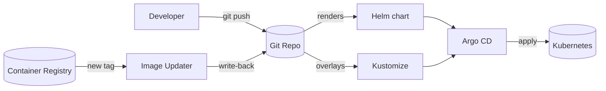

# 01 — Packaging & GitOps

Tools that turn Git into the single source of truth and render/apply Kubernetes
manifests declaratively.

| Component | What it does | File |
|-----------|--------------|------|
| **Helm** | Packages K8s manifests into versioned, templated charts | [helm.md](helm.md) |
| **Kustomize** | Template-free overlays/patches on plain YAML | [kustomize.md](kustomize.md) |
| **Argo CD** | GitOps engine — syncs Git to the cluster | [argocd.md](argocd.md) |
| **Argo CD Image Updater** | Auto-bumps image tags when new versions are pushed | [image-updater.md](image-updater.md) |

## How they fit together

- **Helm** builds the packages, **Kustomize** patches them per environment, **Argo CD**
  syncs the result to the cluster, and **Image Updater** closes the loop by writing
  new image tags back to Git.
- See [argocd.md](argocd.md) for the GitOps engine [Image Updater](image-updater.md) depends on.
