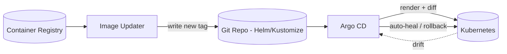

# Argo CD

> The **GitOps engine** — continuously syncs a Git repo (Helm/Kustomize) to the
> cluster. [Argo CD Image Updater](image-updater.md) is useless without it: it only
> updates apps Argo CD manages.

- **Category:** Packaging & GitOps
- **Website:** <https://argo-cd.readthedocs.io>
- **Built with:** Go
- **License:** Apache-2.0

---

## 1. What it is

Argo CD is a declarative GitOps continuous-delivery tool for Kubernetes. It
watches one or more Git repos, renders the manifests (raw YAML, Helm, Kustomize,
or plugins), and continuously reconciles the live cluster state to match — with
drift detection, auto-heal, and one-click/automatic rollback.

## 2. What it's used for

- **Declarative apps** — an `Application` CR points at a repo path + target
  cluster/namespace; Argo CD keeps them in sync.
- **Drift detection & auto-heal** — manual `kubectl edit` changes are flagged (and
  optionally reverted) to match Git.
- **Sync waves** — ordering resource application (e.g. CRDs → operators →
  databases → apps) via annotations.
- **RBAC & multi-cluster** — project-scoped permissions; one Argo CD can manage
  many clusters.

## 3. Architecture



- **App of Apps** — a root `Application` manages child `Application` CRs, so the
  entire platform bootstraps from one Argo CD sync.

## 4. Dependencies

- **Git repo** as source of truth (the platform's deployment repo).
- **[Helm](helm.md)** / **[Kustomize](kustomize.md)** as rendering engines.
- **[Argo CD Image Updater](image-updater.md)** is a consumer, not a dependency —
  it needs Argo CD, not the other way around.

## 5. How to use

```sh
helm repo add argo https://argoproj.github.io/argo-helm
helm install argocd argo/argo-cd -n argocd --create-namespace
```

### Register an app
```yaml
apiVersion: argoproj.io/v1alpha1
kind: Application
metadata: { name: langfuse, namespace: argocd }
spec:
  project: default
  source:
    repoURL: https://github.com/<org>/<repo>.git
    path: charts/langfuse
    targetRevision: main
  destination: { server: https://kubernetes.default.svc, namespace: langfuse }
  syncPolicy:
    automated: { prune: true, selfHeal: true }
```

### Sync waves (enforce deployment order)
```yaml
metadata:
  annotations:
    argocd.argoproj.io/sync-wave: "1"   # lower numbers sync first
```
Use this to enforce the order in the master
[dependency cheat-sheet](../README.md#5-dependency-cheat-sheet) (e.g. GPU Operator
→ databases → apps).

## 6. How it's used here

- The single control point that applies every component in the platform's
  deployment repo to the cluster — "app of apps" bootstraps GPU Operator, storage, databases, and
  platform apps in the right order via sync waves.
- [Image Updater](image-updater.md) writes new image tags back to Git; Argo CD picks
  up the change and syncs it.

## 7. Gotchas

- Without **sync waves**, Argo CD applies everything roughly in parallel — CRDs and
  operators must go first or dependent resources fail.
- **Auto-heal** will revert manual `kubectl` fixes — good for drift prevention, but
  surprising during incident debugging (pause auto-sync first).
- Secrets should never live in the Git repo Argo CD watches — pull them via
  [OpenBao](../05-security-secrets/openbao.md) / External Secrets instead.
