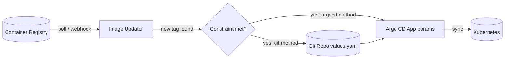

# Argo CD Image Updater (imageupdater)

> Automatically detects new container image versions in your registry and updates
> the running Kubernetes workloads managed by **Argo CD** — no manual tag bumps.

- **Category:** Packaging & GitOps
- **Project:** <https://argocd-image-updater.readthedocs.io>
- **Repo:** `argoproj-labs/argocd-image-updater`
- **License:** Apache-2.0

---

## 1. What it is

A controller that runs a reconciliation loop: it watches Argo CD `Application`s,
queries the container registry for newer tags of the images those apps deploy,
and — when a new tag satisfies your version constraint — tells Argo CD to deploy
it. It's the equivalent of running `argocd app set --helm-set image.tag=v1.0.1`
automatically, forever.

> **Note (v1.x):** configuration moved from Argo CD `Application` **annotations**
> to a dedicated **`ImageUpdater` CRD**. Older `0.x` releases use annotations.

## 2. What it's used for

- **Continuous delivery of images** — push a new image, it rolls out on its own.
- **Controlled auto-updates** via strategies:
  - `semver` — highest version matching a constraint (e.g. `~1.4`).
  - `newest-build` (was `latest`) — most recently pushed tag.
  - `alphabetical` (was `name`) — last tag alphabetically.
  - `digest` — track a mutable tag (e.g. `stable`) by digest.
- **Git write-back** — commit the new tag back to your Helm `values.yaml` or
  Kustomize `images:` list so Git stays the source of truth.
- **Webhook mode** — react instantly to registry push events (Docker Hub, GHCR, Quay, Harbor).

## 3. How it works



**Two update (write-back) methods:**
- **`argocd`** — sets the parameter directly on the live Argo CD Application (fast, but drifts from Git).
- **`git`** — commits the change to the repo; Argo CD then syncs from Git (true GitOps, auditable). **Preferred.**

## 4. Requirements & limitations

- **Requires [Argo CD](argocd.md)** — it only updates apps Argo CD manages. Hard dependency.
- Apps **must** be rendered by **Helm** or **Kustomize**, and the template must
  expose the tag as a parameter (`image.tag`) or a Kustomize `images:` entry.
- Image **pull secrets** must live in (or be reachable from) the cluster where
  Image Updater runs.
- In v1.x, the `ImageUpdater` CR must live in the **same namespace** as the
  `Application`s it targets (`spec.namespace` was removed).

## 5. How to use

### Install (Helm)
```sh
helm repo add argo https://argoproj.github.io/argo-helm
helm install argocd-image-updater argo/argocd-image-updater -n argocd
```

### Configure an update (v1.x CRD)
```yaml
apiVersion: argocd-image-updater.argoproj.io/v1alpha1
kind: ImageUpdater
metadata:
  name: my-service-updater
  namespace: argocd            # same namespace as the Application
spec:
  applicationRefs:
    - namePattern: "my-service"
      images:
        - alias: app
          imageName: ghcr.io/example/my-service
          updateStrategy: semver
          constraint: "~1.4"           # only 1.4.x
  writeBackMethod:
    method: git                        # commit tag back to Git
```

### Legacy annotation style (0.x)
```yaml
metadata:
  annotations:
    argocd-image-updater.argoproj.io/image-list: app=ghcr.io/example/my-service
    argocd-image-updater.argoproj.io/app.update-strategy: semver
    argocd-image-updater.argoproj.io/write-back-method: git
```

### Observe
```sh
kubectl logs -n argocd deploy/argocd-image-updater -f
kubectl get imageupdater -n argocd        # v1.x: status shows matched apps + recent updates
```

## 6. Dependencies & how it's used here

- **Requires:** Argo CD (control loop), a registry credential, and Helm/Kustomize-rendered apps.
- **Edits:** [Helm](helm.md) `values.yaml` tags or [Kustomize](kustomize.md) `images:` entries.
- **Role here:** keeps GPU inference images, Langfuse, MLflow, etc. current without
  manual PRs, while preserving Git as the audit trail (use `git` write-back).

## 7. Gotchas

- Pin a **`constraint`** — an unbounded `newest-build` strategy can deploy a broken
  `:latest`. Prefer `semver` with a range in production.
- Give write-back a **dedicated Git credential** with least privilege (push to the
  config repo only).
