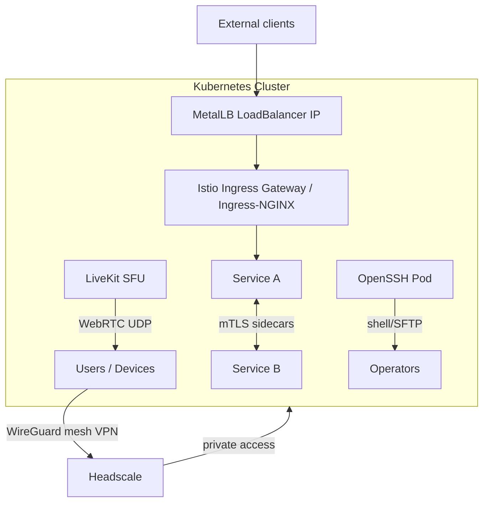

# 02 — Networking & Connectivity

Everything that moves traffic securely: service-to-service mesh, node/user mesh
VPN, real-time media, and operator shell access.

| Component | What it does | File |
|-----------|--------------|------|
| **Istio** | Service mesh — mTLS, routing, telemetry between pods | [istio.md](istio.md) |
| **Headscale Operator** | Self-hosted Tailscale control plane (mesh VPN) | [headscale-operator.md](headscale-operator.md) |
| **LiveKit** | WebRTC SFU for real-time voice/video AI agents | [livekit.md](livekit.md) |
| **OpenSSH Server** | SSH/SFTP access into the cluster (dev + GPU shells) | [openssh-server.md](openssh-server.md) |
| **MetalLB + Ingress-NGINX** | Bare-metal LoadBalancer IPs & L7 ingress routing | [metallb-ingress.md](metallb-ingress.md) |

## Layers of connectivity

- **Headscale** = private overlay network (who can reach the cluster at all).
- **MetalLB + Ingress-NGINX** = bare-metal entry point (how external traffic reaches the mesh).
- **Istio** = east-west security & traffic control (how pods talk to each other).
- **LiveKit** = north-south real-time media (WebRTC to end users).
- **OpenSSH** = operator/dev access into specific pods or GPU nodes.
