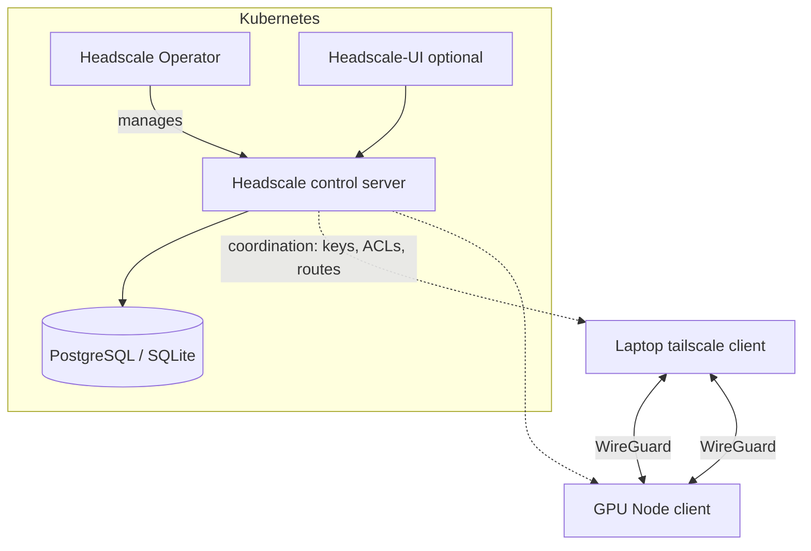

# Headscale Operator

> Runs **Headscale** — an open-source, self-hosted implementation of the Tailscale
> control server — on Kubernetes, managed declaratively via an **operator/CRDs**.

- **Category:** Networking & Connectivity
- **Headscale:** <https://headscale.net> (`juanfont/headscale`)
- **Built with:** Go; uses **WireGuard** for the actual data plane
- **License:** BSD-3-Clause (Headscale)

---

## 1. What it is

**Tailscale** is a mesh VPN built on **WireGuard**: devices form a flat, encrypted
overlay network (a *tailnet*) and reach each other by stable IPs/names regardless
of NAT or firewalls. The **control server** coordinates keys, ACLs, and routes.

**Headscale** is a self-hosted, open-source replacement for that control server —
so you own the coordination plane instead of relying on Tailscale's SaaS.

The **Headscale Operator** packages Headscale as a Kubernetes-native deployment:
you manage the control server, pre-auth keys, users, and node ACLs through custom
resources and a Helm chart, following the standard `templates/ + Chart.yaml +
values.yaml` layout.

## 2. What it's used for

- **Private access to the cluster/GPU nodes** — operators and CI join the tailnet
  and reach services over WireGuard without exposing public LoadBalancers.
- **Multi-node / multi-site GPU** — securely connect GPU nodes across data centers,
  homelabs, or clouds into one flat network.
- **Subnet routing & exit nodes** — expose in-cluster CIDRs to remote clients.
- **Zero-trust ingress** — combine with [Istio](istio.md) so only tailnet identities
  reach sensitive dashboards ([Grafana](../03-observability-llmops/grafana.md),
  [MLflow](../03-observability-llmops/mlflow.md), [OpenBao](../05-security-secrets/openbao.md)).

## 3. Architecture



- **Control plane:** Headscale (issues keys, distributes the network map, enforces ACLs).
- **Data plane:** direct **WireGuard** tunnels between nodes (peer-to-peer, encrypted;
  DERP relays only when NAT traversal fails).
- **Clients:** the standard Tailscale client, pointed at your Headscale URL via `--login-server`.
- **Optional UI:** `headscale-ui` (needs a reverse proxy on the same subdomain; API-key auth).

## 4. Dependencies

- **Storage:** SQLite (simple) or **PostgreSQL** (HA/production).
- **TLS:** a real domain + cert (via [cert-manager](../05-security-secrets/cert-manager.md)
  or a reverse proxy) — the control server must be HTTPS.
- **Ingress:** a `LoadBalancer`/Ingress to expose the control server endpoint.
- **Clients:** Tailscale must be installed on each joining device/node.

## 5. How to use

### Deploy (Helm-style)
```sh
helm install headscale <headscale-chart> -n headscale --create-namespace \
  -f values.yaml
```

Key `values.yaml` bits (mirrors Headscale's `config.yaml`):
```yaml
server_url: https://hs.example.internal
listen_addr: 0.0.0.0:8080
database:
  type: postgres
  postgres: { host: postgres, name: headscale, user: headscale }
dns:
  base_domain: example.net
```

### Manage users & nodes (control server CLI)
```sh
kubectl exec -n headscale deploy/headscale -- \
  headscale users create myuser

kubectl exec -n headscale deploy/headscale -- \
  headscale preauthkeys create --user myuser --reusable --expiration 24h

headscale nodes list
headscale routes enable -r <route-id>       # approve a subnet route
```

### Join a device/node
```sh
tailscale up --login-server https://hs.example.internal --authkey <preauth-key>
tailscale up --login-server https://hs.example.internal \
  --advertise-routes=10.42.0.0/16          # expose cluster pod CIDR
```

## 6. How it's used here

- Provides the **private transport** under everything: admin UIs, SSH, and
  cross-node GPU traffic ride the tailnet instead of the public internet.
- Complements [OpenSSH Server](openssh-server.md) — SSH targets are reachable by
  their stable tailnet IPs.
- Pairs with [Istio](istio.md): Headscale controls *who reaches the cluster*,
  Istio controls *what they can do inside it*.

## 7. Gotchas

- The control server must be **highly available** if the tailnet is critical —
  use PostgreSQL + multiple replicas behind the operator.
- ACL policy (`acls`) is deny-by-default once set — test with `headscale` policy checks.
- `headscale-ui` requires same-subdomain hosting or CORS headers injected by the proxy.
