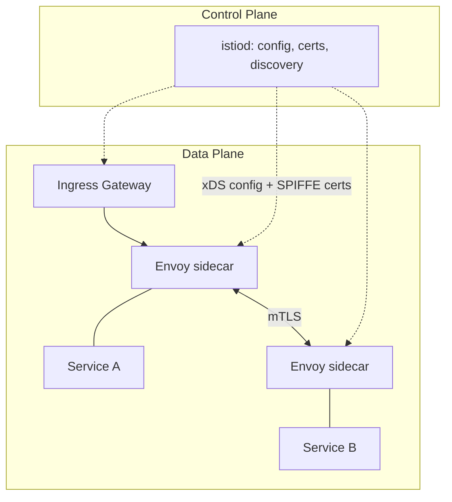

# Istio

> The de-facto **service mesh** for Kubernetes. Adds mTLS, traffic management,
> and observability to service-to-service communication without changing app code.

- **Category:** Networking & Connectivity
- **Website:** <https://istio.io>
- **Built with:** Go (control plane) + Envoy (C++ data plane proxy)
- **License:** Apache-2.0 (CNCF graduated project)

---

## 1. What it is

Istio injects a lightweight **Envoy proxy sidecar** (or a per-node **Ambient**
ztunnel) next to every workload. All pod traffic flows through these proxies,
which the Istio control plane (`istiod`) configures centrally. This gives you
security, routing, and telemetry as an infrastructure layer, transparent to the app.

## 2. What it's used for

- **Zero-trust mTLS** — automatic mutual TLS between all meshed services (encryption + identity).
- **Traffic management** — canary/blue-green, weighted routing, retries, timeouts,
  circuit breaking, fault injection (`VirtualService` / `DestinationRule`).
- **Ingress/egress gateways** — controlled entry/exit points for the mesh.
- **Observability** — golden metrics, distributed traces, and a service topology
  (feeds [Grafana](../03-observability-llmops/grafana.md) / Kiali / Prometheus).
- **Policy** — authN/authZ (`AuthorizationPolicy`), rate limits, access control.

In an AI platform this secures traffic between inference services, RAG APIs,
vector DB, and Langfuse, and enables safe canary rollouts of new model versions.

## 3. Architecture



- **`istiod`** — single control-plane binary: service discovery, config distribution
  (xDS), and certificate issuance (SPIFFE identities).
- **Data plane** — Envoy sidecars (or Ambient ztunnel/waypoint proxies).
- **Modes:** *Sidecar* (classic, per-pod) or *Ambient* (sidecar-less, per-node ztunnel
  + optional waypoint for L7 — lower overhead, good for dense GPU nodes).

## 4. Key CRDs

| CRD | Purpose |
|-----|---------|
| `Gateway` | L4-L6 entry point (ports/hosts/TLS) at the mesh edge |
| `VirtualService` | L7 routing rules (paths, weights, retries, mirrors) |
| `DestinationRule` | Load-balancing, connection pools, mTLS mode, subsets |
| `PeerAuthentication` | Enforce/relax mTLS (`STRICT`/`PERMISSIVE`) |
| `AuthorizationPolicy` | Who can call what (identity/namespace/path scoped) |
| `ServiceEntry` | Register external services into the mesh (egress) |

## 5. How to use

### Install (Helm — production pattern)
```sh
helm repo add istio https://istio-release.storage.googleapis.com/charts
helm repo update
kubectl create namespace istio-system

helm install istio-base istio/base -n istio-system
helm install istiod istio/istiod -n istio-system --wait
helm install istio-ingress istio/gateway -n istio-system
```

### Enable sidecar injection & verify
```sh
kubectl label namespace ai-apps istio-injection=enabled
kubectl rollout restart deploy -n ai-apps          # re-inject sidecars
istioctl proxy-status                              # sidecar sync health
istioctl analyze -n ai-apps                        # config lint
```

### Canary route example
```yaml
apiVersion: networking.istio.io/v1
kind: VirtualService
metadata:
  name: llm-router
spec:
  hosts: ["llm.internal"]
  http:
    - route:
        - destination: { host: llm, subset: v1 }
          weight: 90
        - destination: { host: llm, subset: v2 }   # 10% canary
          weight: 10
```

### Enforce mesh-wide mTLS
```yaml
apiVersion: security.istio.io/v1
kind: PeerAuthentication
metadata:
  name: default
  namespace: istio-system
spec:
  mtls: { mode: STRICT }
```

## 6. Dependencies & how it's used here

- **Requires:** Kubernetes ≥ supported version, a `LoadBalancer` for the ingress
  gateway (see [MetalLB](metallb-ingress.md) on bare metal),
  and [cert-manager](../05-security-secrets/cert-manager.md) if you terminate public TLS.
- **Feeds:** Prometheus/Grafana with mesh metrics; integrates with Kiali for topology.
- **Alternative to:** a plain Ingress controller — Istio's Gateway can replace it.

## 7. Gotchas

- Sidecars add CPU/RAM per pod; on GPU nodes with many pods consider **Ambient mode**.
- `STRICT` mTLS breaks traffic from non-meshed clients — roll out with `PERMISSIVE` first.
- WebRTC/UDP media ([LiveKit](livekit.md)) generally **bypasses** the mesh — don't
  force it through Envoy.
