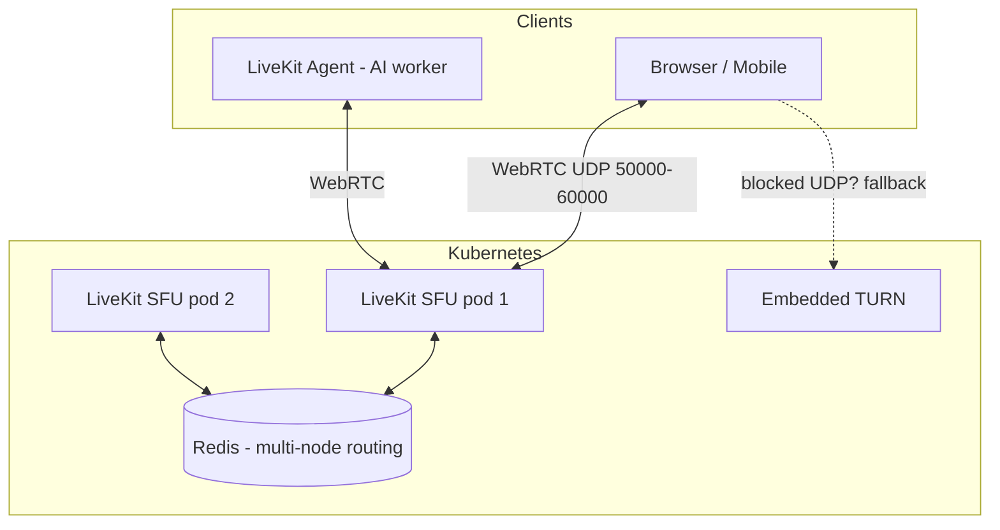

# LiveKit

> Open-source **WebRTC SFU** (Selective Forwarding Unit) and real-time media
> server. The backbone for low-latency voice/video — including **real-time AI
> voice agents**.

- **Category:** Networking & Connectivity
- **Website:** <https://livekit.io> · Docs: <https://docs.livekit.io>
- **Built with:** Go (server) + Pion/WebRTC
- **License:** Apache-2.0

---

## 1. What it is

LiveKit is a scalable media server that routes real-time audio/video/data streams
between participants in a "room" using **WebRTC**. As an **SFU**, it forwards each
publisher's stream to subscribers (instead of mixing), keeping latency low and
CPU manageable. It ships SDKs for web, mobile, and server, plus an **Agents**
framework for building voice AI (STT → LLM → TTS) pipelines.

## 2. What it's used for

- **Real-time voice AI agents** — connect a caller to an LLM with sub-second latency
  (LiveKit Agents orchestrates speech-to-text, the model, and text-to-speech).
- **Video conferencing / live streaming / telehealth / gaming voice.**
- **Ingress/Egress** — pull RTMP/WHIP streams in, or record/export rooms out.
- **Data channels** — low-latency messaging alongside media.

In this platform, LiveKit is the north-south real-time edge for conversational AI
served by [Serverless GPU](../06-gpu-compute/serverless-gpu.md) inference.

## 3. Architecture



- **SFU pods** forward media; **Redis** coordinates rooms/participants across nodes
  (required for multi-node horizontal scaling).
- **Embedded TURN** relays media for clients behind restrictive firewalls (TURN/TLS
  on 443 gives the broadest reachability).
- **Agents** are server-side participants that plug AI into a room.

## 4. Dependencies

- **[Redis](../04-data-state/redis.md)** — **required** for multi-node deployments
  (room/participant state, node routing). Single-node can run without it.
- **UDP port range** (e.g. `50000-60000`) + TCP `7881` must be reachable — this is
  the #1 deployment gotcha. Use **host networking** for best performance.
- **Domain + trusted SSL cert** — self-signed certs do **not** work; SDKs need `wss://`.
- **Load balancer / external IP** — set `rtc.use_external_ip: true` in cloud/NAT.
- **API key/secret pair** — issued to SDKs as signed JWT access tokens.

## 5. How to use

### Deploy (Helm)
```sh
helm repo add livekit https://helm.livekit.io
helm install livekit livekit/livekit-server -n livekit --create-namespace \
  -f values.yaml
```

### Core config (`values.yaml` → LiveKit `config.yaml`)
```yaml
port: 7880
rtc:
  tcp_port: 7881
  port_range_start: 50000
  port_range_end: 60000
  use_external_ip: true
redis:
  address: redis-master.data:6379      # required for multi-node
keys:
  <api_key>: <api_secret>
turn:
  enabled: true
  domain: turn.example.net
  tls_port: 443
```

### Generate an access token & test
```sh
livekit-cli create-token --api-key <k> --api-secret <s> \
  --room demo --identity user1 --join

livekit-cli load-test --room demo --publishers 5 --subscribers 50
```

## 6. How it's used here

- **User-facing real-time layer** for voice/video AI; the actual model inference
  runs on [Serverless GPU](../06-gpu-compute/serverless-gpu.md).
- **Traces/metrics** of agent turns can be sent to
  [Langfuse](../03-observability-llmops/langfuse.md); Prometheus metrics exposed on `:6789`.
- Media (UDP) intentionally **bypasses [Istio](istio.md)** sidecars; secure the
  signaling endpoint (`wss`) at the edge instead.

## 7. Gotchas

- WebRTC needs **UDP** — clusters that only allow TCP/443 require **TURN/TLS on 443**.
- Behind NAT/cloud, wrong `use_external_ip`/advertised IP = "connects then no media."
- Scale horizontally only **with Redis** wired to every pod.
