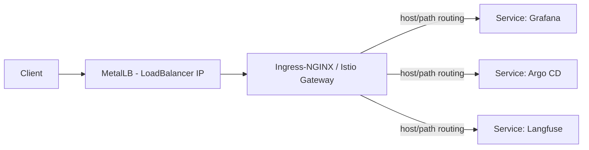

# MetalLB + Ingress-NGINX

> Bare-metal networking: there's no cloud `LoadBalancer` on a self-managed
> multi-node cluster. **MetalLB** provides `LoadBalancer` IPs; an **Ingress
> controller** handles L7 routing for dashboards and APIs.

- **Category:** Networking & Connectivity
- **Website:** <https://metallb.universe.tf> · <https://kubernetes.github.io/ingress-nginx/>
- **Built with:** Go
- **License:** Apache-2.0

---

## 1. What it is

- **MetalLB** — implements the Kubernetes `LoadBalancer` service type on bare
  metal, either via **Layer 2** (ARP/NDP failover, simplest) or **BGP** (real
  ECMP load balancing, needs router support).
- **Ingress-NGINX** — an Ingress controller that consumes a `LoadBalancer` IP from
  MetalLB and routes HTTP(S) by host/path to backend Services.

Together they replace what a cloud provider's LB + ALB/NLB would normally give you.

## 2. What it's used for

- Giving [Istio's](istio.md) ingress gateway (or Ingress-NGINX directly) a real,
  externally-reachable IP.
- Exposing [Grafana](../03-observability-llmops/grafana.md), Argo CD, and other
  dashboards behind host-based routing instead of `kubectl port-forward`.
- Terminating public entry points that [cert-manager](../05-security-secrets/cert-manager.md)
  issues TLS for.

## 3. Architecture



## 4. Dependencies

- **A free IP range** on the node network for MetalLB's address pool.
- **[cert-manager](../05-security-secrets/cert-manager.md)** for TLS on Ingress
  resources (HTTP-01 challenges route through here).
- If using [Istio](istio.md) as the gateway, Ingress-NGINX may be optional —
  MetalLB alone can front the Istio gateway Service.

## 5. How to use

```sh
helm repo add metallb https://metallb.github.io/metallb
helm install metallb metallb/metallb -n metallb-system --create-namespace
```

### Layer 2 address pool
```yaml
apiVersion: metallb.io/v1beta1
kind: IPAddressPool
metadata: { name: default-pool, namespace: metallb-system }
spec: { addresses: ["192.168.1.240-192.168.1.250"] }
---
apiVersion: metallb.io/v1beta1
kind: L2Advertisement
metadata: { name: default, namespace: metallb-system }
spec: { ipAddressPools: ["default-pool"] }
```

### Ingress controller
```sh
helm repo add ingress-nginx https://kubernetes.github.io/ingress-nginx
helm install ingress-nginx ingress-nginx/ingress-nginx \
  -n ingress-nginx --create-namespace
```

## 6. How it's used here

- Provides the externally-reachable IP for the [Istio](istio.md) ingress gateway
  and/or Ingress-NGINX, which then routes to Grafana, Argo CD, Langfuse, etc.
- Sits underneath [cert-manager's](../05-security-secrets/cert-manager.md) ACME
  HTTP-01 challenge path for public TLS.

## 7. Gotchas

- Layer 2 mode has a single active node per IP (failover on node loss, not true
  load-balancing) — use BGP mode if the router supports it and real distribution matters.
- The MetalLB address pool must not overlap DHCP-assigned addresses on the LAN.
- Running both Istio ingress gateway and Ingress-NGINX is usually redundant — pick
  one as the actual internet-facing entry point.
