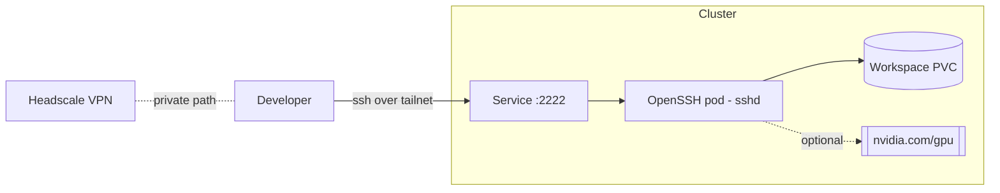

# OpenSSH Server

> A containerized **SSH/SFTP server** running inside the cluster to give operators
> and developers secure shell access to a controlled entry point.

- **Category:** Networking & Connectivity
- **Common image:** `linuxserver/openssh-server` (or a custom hardened build)
- **Built with:** OpenSSH (`sshd`)
- **License:** BSD-style (OpenSSH)

---

## 1. What it is

A pod that runs `sshd`, exposed via a Service so authorized users can `ssh`/`sftp`
into the cluster. It acts as a **bastion / jump host** or a **remote dev box**,
often with a persistent volume as a workspace and access to GPU resources.

## 2. What it's used for

- **Bastion / jump host** — a single audited SSH entry point into the private network.
- **Remote development** — attach VS Code Remote-SSH / JetBrains Gateway to a pod
  that has the toolchain, CUDA, and datasets mounted.
- **GPU debugging shell** — request `nvidia.com/gpu` on the SSH pod to poke at drivers,
  run `nvidia-smi`, or reproduce inference issues interactively.
- **SFTP transfer** — move model weights, datasets, or artifacts in/out of PVCs.

## 3. Architecture



Reached privately over the [Headscale](headscale-operator.md) tailnet rather than
a public IP — the SSH port is never exposed to the internet.

## 4. Dependencies

- **Key-based auth** — mount `authorized_keys` via a Secret; **disable password auth**.
- **PersistentVolume** — for a durable home/workspace.
- **Service exposure** — `ClusterIP` (reach via port-forward/tailnet) or `LoadBalancer`
  on a non-standard port (e.g. `2222`).
- Optional: **GPU Operator** if the shell needs GPUs.

## 5. How to use

### Minimal manifest
```yaml
apiVersion: apps/v1
kind: Deployment
metadata: { name: openssh-server }
spec:
  replicas: 1
  selector: { matchLabels: { app: ssh } }
  template:
    metadata: { labels: { app: ssh } }
    spec:
      containers:
        - name: openssh
          image: lscr.io/linuxserver/openssh-server:latest
          env:
            - { name: PUBLIC_KEY, valueFrom: { secretKeyRef: { name: ssh-key, key: pub } } }
            - { name: USER_NAME, value: devuser }
            - { name: SUDO_ACCESS, value: "false" }
            - { name: PASSWORD_ACCESS, value: "false" }
          ports: [{ containerPort: 2222 }]
          volumeMounts: [{ name: work, mountPath: /config }]
      volumes:
        - name: work
          persistentVolumeClaim: { claimName: ssh-workspace }
```

### Connect
```sh
kubectl port-forward svc/openssh-server 2222:2222 -n dev
ssh -p 2222 devuser@localhost
sftp -P 2222 devuser@localhost
```

## 6. How it's used here

- **Operator access** to GPU nodes and dev workspaces, reached over the
  [Headscale](headscale-operator.md) mesh VPN.
- Alternative to `kubectl exec` for long-lived, IDE-friendly remote sessions.

## 7. Gotchas — security first

- **Never** enable password auth or expose `sshd` publicly. Keys + tailnet only.
- Run as **non-root**, no `SUDO_ACCESS` unless required.
- Restrict the Service with `NetworkPolicy`; log and audit sessions.
- Treat it as a bastion: minimal tooling, no long-lived cloud credentials on the pod
  (fetch just-in-time creds from [OpenBao](../05-security-secrets/openbao.md)).
