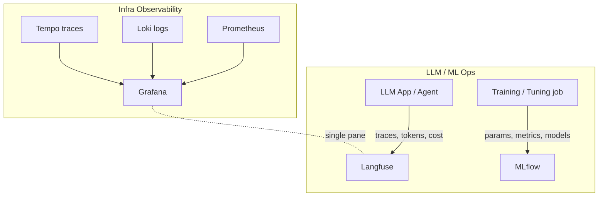

# 03 — Observability & LLMOps

Seeing what the platform and the models are doing: infra metrics/logs/traces plus
LLM-specific tracing and ML experiment lifecycle.

| Component | What it does | File |
|-----------|--------------|------|
| **Grafana** | Dashboards for metrics, logs, and traces | [grafana.md](grafana.md) |
| **Prometheus** | Metrics time-series store — Grafana's primary data source | [prometheus.md](prometheus.md) |
| **Loki + Tempo** | Log aggregation & distributed tracing for Grafana | [loki-tempo.md](loki-tempo.md) |
| **Langfuse** | LLM tracing, evals, prompt mgmt, cost tracking | [langfuse.md](langfuse.md) |
| **MLflow** | Experiment tracking, model registry, artifacts | [mlflow.md](mlflow.md) |

## Two observability planes

- **Grafana** answers *"is the cluster/GPU healthy?"* (utilization, latency, errors).
- **Langfuse** answers *"is the LLM behaving/costing well?"* (traces, quality, spend).
- **MLflow** answers *"which model/run/version is this, and how was it produced?"*
