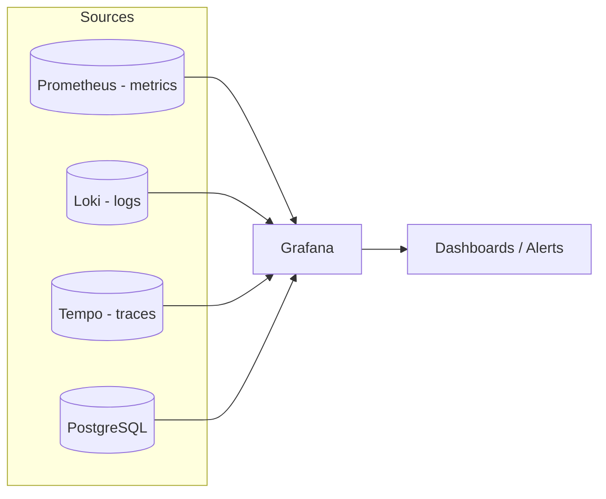

# Grafana

> The open-source **visualization and dashboarding** layer. Unifies metrics, logs,
> and traces from many data sources into a single pane of glass.

- **Category:** Observability & LLMOps
- **Website:** <https://grafana.com>
- **Built with:** Go (backend) + TypeScript/React (frontend)
- **License:** AGPL-3.0

---

## 1. What it is

Grafana connects to time-series and log/trace **data sources** (Prometheus, Loki,
Tempo, PostgreSQL, and 150+ others) and renders **dashboards**, **alerts**, and
**explore** views. It does not store data itself — it queries backends and
visualizes the results.

## 2. What it's used for

- **Cluster & GPU dashboards** — node/pod CPU, memory, GPU utilization, VRAM,
  temperature, and power (via DCGM exporter from the NVIDIA GPU Operator).
- **App & mesh metrics** — request rate/latency/errors from [Istio](../02-networking-connectivity/istio.md).
- **Logs & traces** — `Explore` against Loki (logs) and Tempo (traces), correlated.
- **Alerting** — threshold/anomaly alerts to Slack, PagerDuty, email, webhooks.
- **SLO tracking** — inference latency, queue depth, GPU saturation.

## 3. Architecture



Usually deployed as part of the **kube-prometheus-stack** Helm chart (Prometheus +
Grafana + Alertmanager + exporters preconfigured together).

## 4. Dependencies

- **Data source(s)** — at minimum [Prometheus](prometheus.md).
  Add [Loki (logs) and Tempo (traces)](loki-tempo.md) for full coverage.
- **Storage for Grafana state** — SQLite (default, single replica) or **PostgreSQL/MySQL**
  for HA/multi-replica.
- **Persistence** — a PVC for dashboards/plugins if not provisioned as code.

## 5. How to use

### Install (kube-prometheus-stack — recommended)
```sh
helm repo add prometheus-community https://prometheus-community.github.io/helm-charts
helm install monitoring prometheus-community/kube-prometheus-stack \
  -n monitoring --create-namespace
```

### Or standalone Grafana
```sh
helm repo add grafana https://grafana.github.io/helm-charts
helm install grafana grafana/grafana -n monitoring \
  --set persistence.enabled=true \
  --set adminPassword='<from-openbao>'
```

### Access & first login
```sh
kubectl get secret -n monitoring grafana -o jsonpath="{.data.admin-password}" | base64 -d
kubectl port-forward svc/grafana 3000:80 -n monitoring
# open http://localhost:3000
```

### Provision as code (GitOps-friendly)
```yaml
# values.yaml
datasources:
  datasources.yaml:
    apiVersion: 1
    datasources:
      - name: Prometheus
        type: prometheus
        url: http://prometheus-server.monitoring:80
        isDefault: true
dashboardProviders: { ... }     # load dashboards from ConfigMaps
```
Import ready-made dashboards by ID (e.g. **NVIDIA DCGM** = 12239, **Istio** = 7639).

## 6. How it's used here

- **Single pane** for GPU health across the multi-node cluster (critical for
  spotting stragglers/thermal throttling during training/inference).
- Admin credentials sourced from [OpenBao](../05-security-secrets/openbao.md);
  access gated behind the [Headscale](../02-networking-connectivity/headscale-operator.md) tailnet.
- Complements [Langfuse](langfuse.md) (LLM quality/cost) and
  [MLflow](mlflow.md) (experiment lineage).

## 7. Gotchas

- Default SQLite backend can't run multiple replicas — use PostgreSQL for HA.
- Provision dashboards/datasources **as code** so they survive pod restarts and are
  reproducible via GitOps.
- AGPL-3.0 licensing matters if you redistribute a modified Grafana.
