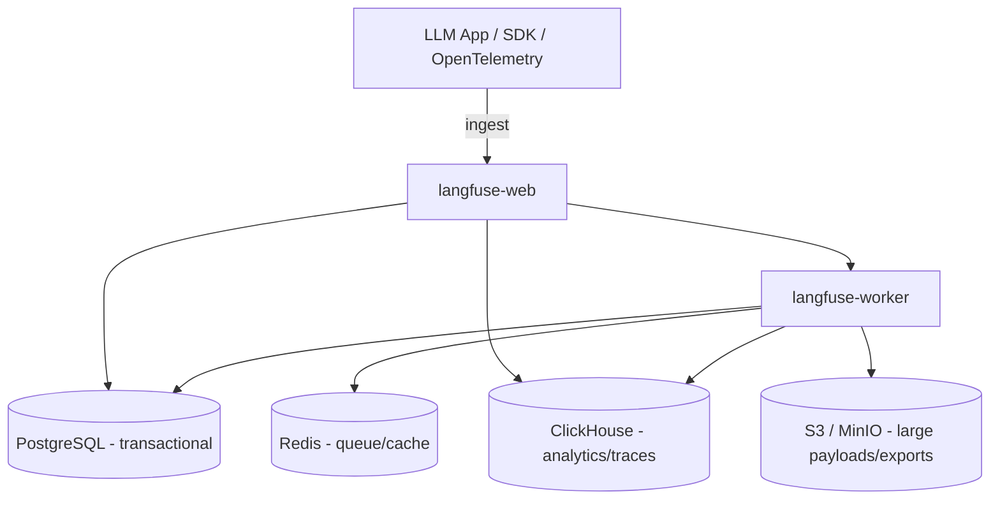

# Langfuse

> Open-source **LLM engineering platform**: tracing, evaluation, prompt management,
> and cost/latency analytics for LLM applications and agents.

- **Category:** Observability & LLMOps
- **Website:** <https://langfuse.com> · Charts: `langfuse/langfuse-k8s`
- **Built with:** TypeScript/Next.js (web) + workers
- **License:** MIT core (some enterprise features under EE license)

---

## 1. What it is

Langfuse instruments your LLM app so every request becomes a **trace**: the prompt,
model, tokens, latency, cost, tool calls, retrieved context, and output. On top of
that data it provides **evaluations** (LLM-as-judge, human annotation, custom
scores), **prompt management** (versioned prompts served via API), and dashboards
for **spend and quality**.

## 2. What it's used for

- **Debugging agents/RAG** — see the full nested trace of a multi-step chain.
- **Cost & token analytics** — per model, user, feature, or project.
- **Evaluation** — score outputs (accuracy, toxicity, relevance) at scale.
- **Prompt management** — version, A/B test, and deploy prompts without redeploying code.
- **Datasets** — curate examples and run regression tests on prompt/model changes.

## 3. Architecture (self-hosted)



The Helm chart deploys **two app components** (`langfuse-web`, `langfuse-worker`)
plus **four data stores**. You can let the chart provision them or point to existing
managed instances.

## 4. Dependencies — **four data stores required**

| Store | Purpose |
|-------|---------|
| **PostgreSQL** | Transactional data (users, projects, prompts, config) |
| **ClickHouse** | High-volume trace/observation analytics |
| **Redis** | Queue + cache between web and worker |
| **S3 / MinIO** | Blob storage for large event payloads, media, exports |

> This is the heaviest single dependency footprint in the stack — plan capacity
> accordingly. See [ClickHouse](../04-data-state/clickhouse.md),
> [Redis](../04-data-state/redis.md), and [MinIO](../04-data-state/minio.md).

## 5. How to use

### Deploy (Helm)
```sh
helm repo add langfuse https://langfuse.github.io/langfuse-k8s
helm repo update
kubectl create namespace langfuse
helm install langfuse langfuse/langfuse -n langfuse -f values.yaml
```
> The chart assumes the release name is `langfuse`; using another name requires
> adjusting the Redis hostname in `values.yaml`.

### Smoke test
```sh
kubectl get pods -n langfuse           # web + worker restart a few times until DBs are ready
kubectl port-forward svc/langfuse-web 3000:3000 -n langfuse
# open http://localhost:3000 → register → create org/project → copy API keys
```

### Instrument an app (Python)
```python
from langfuse.openai import openai   # drop-in wrapper auto-traces calls
openai.chat.completions.create(model="gpt-4o", messages=[...])
```
Or use the native SDK / OpenTelemetry exporter and point `LANGFUSE_HOST` at your instance.

### Upgrade
```sh
helm repo update && helm upgrade langfuse langfuse/langfuse -n langfuse
```

## 6. How it's used here

- **The LLM observability hub** — inference from [Serverless GPU](../06-gpu-compute/serverless-gpu.md)
  and voice turns from [LiveKit](../02-networking-connectivity/livekit.md) agents
  report traces here.
- Reuses shared [Redis](../04-data-state/redis.md); pulls DB/S3 credentials from
  [OpenBao](../05-security-secrets/openbao.md).
- Complements [Grafana](grafana.md) (infra) and [MLflow](mlflow.md) (model lineage).

## 7. Gotchas

- Enable **encryption** and set a strong `NEXTAUTH_SECRET`/`SALT` — traces can
  contain sensitive prompt data; use [data masking](https://langfuse.com/self-hosting)
  for PII.
- ClickHouse is resource-hungry; size disks for trace retention.
- Don't send raw secrets in prompts — they'll be stored in traces.
