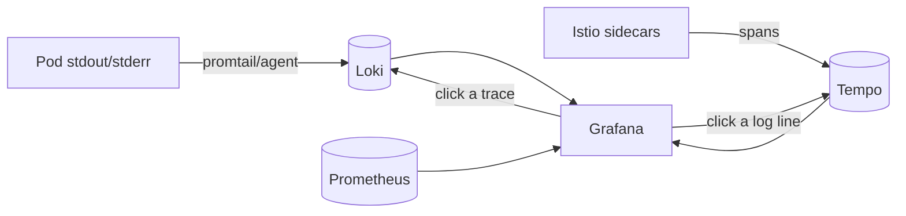

# Loki + Tempo

> Complete the observability trio in [Grafana](grafana.md): **Loki** stores logs,
> **Tempo** stores distributed traces (fed by [Istio](../02-networking-connectivity/istio.md)).

- **Category:** Observability & LLMOps
- **Website:** <https://grafana.com/oss/loki/> · <https://grafana.com/oss/tempo/>
- **Built with:** Go
- **License:** AGPL-3.0 (Loki) / Apache-2.0 (Tempo)

---

## 1. What it is

- **Loki** — a log aggregation system indexed only by labels (not full text),
  making it cheap to run at scale. Queried with **LogQL** (PromQL-like syntax).
- **Tempo** — a distributed tracing backend that stores traces cheaply (object
  storage) and is queried by trace ID or via metrics-generated span queries.

Both are designed to plug directly into Grafana as data sources alongside
[Prometheus](prometheus.md), giving metrics + logs + traces in one pane.

## 2. What it's used for

- **Loki** — centralized pod/container logs, correlated with metrics via shared
  labels (namespace, pod).
- **Tempo** — end-to-end request traces across mesh hops
  ([Istio](../02-networking-connectivity/istio.md) → app → DB), useful for
  debugging latency in RAG/inference call chains.
- **Trace-to-log-to-metric correlation** in Grafana's `Explore` view.

## 3. Architecture



## 4. Dependencies

- **Log shipper** — Promtail, Grafana Agent, or the Alloy collector on every node.
- **Trace instrumentation** — [Istio](../02-networking-connectivity/istio.md)
  emits spans automatically; apps can add OpenTelemetry SDKs for deeper traces.
- **Object storage** ([MinIO](../04-data-state/minio.md)) for chunk/block storage
  at any real scale (filesystem storage doesn't scale past a single node).

## 5. How to use

```sh
helm repo add grafana https://grafana.github.io/helm-charts
helm install loki grafana/loki-stack -n monitoring --set promtail.enabled=true
helm install tempo grafana/tempo -n monitoring
```

### Add as Grafana data sources
```yaml
datasources:
  - name: Loki
    type: loki
    url: http://loki.monitoring:3100
  - name: Tempo
    type: tempo
    url: http://tempo.monitoring:3100
```

## 6. How it's used here

- Rounds out the [Grafana](grafana.md) single-pane-of-glass alongside
  [Prometheus](prometheus.md) — metrics say *something's* slow, Tempo shows
  *where*, Loki shows *why* (error logs).
- Useful for debugging [Serverless GPU](../06-gpu-compute/serverless-gpu.md) cold
  starts and [LiveKit](../02-networking-connectivity/livekit.md) session issues.

## 7. Gotchas

- Loki's default filesystem storage doesn't scale — point both at
  [MinIO](../04-data-state/minio.md)/S3 for anything beyond a demo.
- Tracing only shows what's instrumented — Istio gives you the mesh hops for free,
  but in-process spans need app-level OpenTelemetry.
- AGPL-3.0 (Loki) has redistribution implications if you modify and distribute it.
