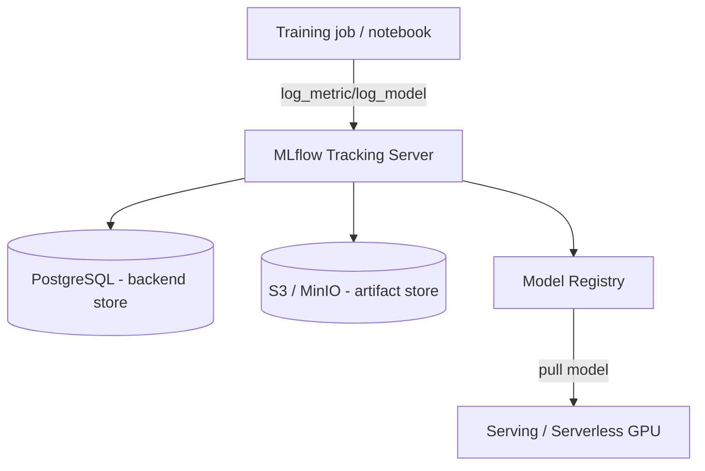

# MLflow

> Open-source platform for the **ML lifecycle**: experiment tracking, a model
> registry, reproducible projects, and model packaging/deployment.

- **Category:** Observability & LLMOps
- **Website:** <https://mlflow.org>
- **Built with:** Python (server) + web UI
- **License:** Apache-2.0

---

## 1. What it is

MLflow records everything about model development so runs are reproducible and
comparable. Its four pillars:

- **Tracking** — log params, metrics, tags, and **artifacts** per run.
- **Model Registry** — versioned models with stage transitions (Staging → Production).
- **Projects** — package code + environment for reproducible runs.
- **Models** — a standard flavor format so a model can be served consistently.

## 2. What it's used for

- **Experiment tracking** — compare hyperparameters/metrics across training runs.
- **Model registry** — a governed catalog of model versions with lineage and stages.
- **Artifact store** — persist checkpoints, weights, plots, and datasets.
- **Reproducibility** — recover exactly which code/data/params produced a model.
- **LLM/fine-tuning** — track eval metrics and register tuned adapters/checkpoints
  that [Serverless GPU](../06-gpu-compute/serverless-gpu.md) then serves.

## 3. Architecture



- **Backend store** (metadata: runs, params, metrics, registry) → a SQL DB.
- **Artifact store** (files: models, plots) → object storage.
- These two are **separate** on purpose — metadata is small/relational, artifacts are large blobs.

## 4. Dependencies

| Need | Options |
|------|---------|
| **Backend store** | PostgreSQL / MySQL (prod) or SQLite (dev only) |
| **Artifact store** | **S3 / MinIO**, GCS, Azure Blob, or a PVC |
| **Auth** | Basic auth, reverse-proxy SSO, or gate via tailnet/Istio |

## 5. How to use

### Deploy (Helm — community chart)
```sh
helm repo add community-charts https://community-charts.github.io/helm-charts
helm install mlflow community-charts/mlflow -n mlflow --create-namespace \
  --set backendStore.postgres.enabled=true \
  --set artifactRoot.s3.enabled=true \
  --set artifactRoot.s3.bucket=mlflow \
  --set artifactRoot.s3.awsAccessKeyId=<from-openbao> \
  --set artifactRoot.s3.awsSecretAccessKey=<from-openbao>
```

### Log a run (Python)
```python
import mlflow
mlflow.set_tracking_uri("http://mlflow.mlflow.svc:5000")
with mlflow.start_run():
    mlflow.log_param("lr", 3e-4)
    mlflow.log_metric("eval_loss", 0.21)
    mlflow.pytorch.log_model(model, "model", registered_model_name="rag-reranker")
```

### Promote & serve a model
```sh
mlflow models serve -m "models:/rag-reranker/Production" -p 5001
# or pull the registry URI into a Serverless GPU deployment
```

## 6. How it's used here

- **Model system of record** — fine-tuned/registered models flow from MLflow into
  [Serverless GPU](../06-gpu-compute/serverless-gpu.md) for inference.
- Shares the **MinIO/S3 artifact store** with [Langfuse](langfuse.md) exports.
- DB/S3 credentials come from [OpenBao](../05-security-secrets/openbao.md); UI access
  gated behind the tailnet.

## 7. Gotchas

- **Never** run the SQLite backend in production — no concurrency; use PostgreSQL.
- Artifact store must be reachable from **both** the server **and** the training
  clients (they upload artifacts directly to S3, not through the server).
- Enable auth — an open tracking server can leak model IP and credentials.
