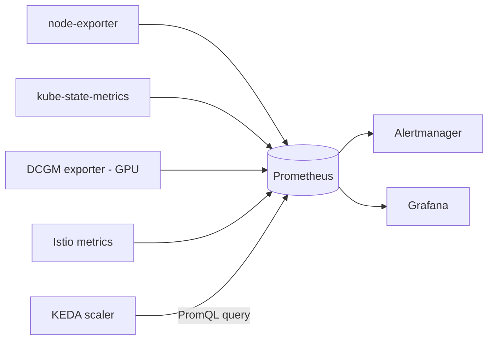

# Prometheus

> The metrics **time-series database** that scrapes and stores everything
> [Grafana](grafana.md) visualizes. Usually deployed as part of the
> **kube-prometheus-stack** bundle.

- **Category:** Observability & LLMOps
- **Website:** <https://prometheus.io>
- **Built with:** Go
- **License:** Apache-2.0

---

## 1. What it is

Prometheus periodically **scrapes** metrics endpoints (`/metrics`), stores them as
time series, and exposes **PromQL** for querying and alerting (via Alertmanager).
It auto-discovers scrape targets in Kubernetes via `ServiceMonitor`/`PodMonitor`
CRDs (Prometheus Operator) or static config.

## 2. What it's used for

- **Cluster metrics** — node/pod CPU, memory, network via `node-exporter` and
  `kube-state-metrics`.
- **GPU metrics** — scrapes the **DCGM exporter** installed by the
  [NVIDIA GPU Operator](../06-gpu-compute/gpu-operator.md).
- **App/mesh metrics** — request rate/latency/errors from
  [Istio](../02-networking-connectivity/istio.md).
- **Autoscaling signal** — [KEDA](../06-gpu-compute/autoscaling.md) can scale on
  arbitrary PromQL queries.
- **Alerting** — Alertmanager routes threshold/anomaly alerts to Slack/PagerDuty/email.

## 3. Architecture



## 4. Dependencies

- **Persistent storage** — a PVC for the TSDB (or remote-write to long-term storage).
- **Prometheus Operator CRDs** (`ServiceMonitor`/`PodMonitor`) if using the operator
  pattern for auto-discovery.
- Feeds — but does not depend on — [Grafana](grafana.md).

## 5. How to use

### Install (bundled with Grafana — recommended)
```sh
helm repo add prometheus-community https://prometheus-community.github.io/helm-charts
helm install monitoring prometheus-community/kube-prometheus-stack \
  -n monitoring --create-namespace
```

### Scrape a custom app
```yaml
apiVersion: monitoring.coreos.com/v1
kind: ServiceMonitor
metadata: { name: langfuse, namespace: langfuse }
spec:
  selector: { matchLabels: { app: langfuse } }
  endpoints: [{ port: metrics, interval: 30s }]
```

### Query (PromQL)
```
sum(rate(DCGM_FI_DEV_GPU_UTIL[5m])) by (Hostname)
```

## 6. How it's used here

- Primary data source for every [Grafana](grafana.md) dashboard (cluster, mesh,
  and GPU health).
- Metric source for [KEDA](../06-gpu-compute/autoscaling.md) scaling decisions on
  [Serverless GPU](../06-gpu-compute/serverless-gpu.md).

## 7. Gotchas

- Unbounded label cardinality (e.g. per-request labels) can blow up TSDB memory —
  keep labels bounded.
- Default local storage isn't durable/HA by default — use `remote_write` to a
  long-term store (Thanos/Mimir) for retention beyond a few weeks.
- `kube-prometheus-stack` bundles its own Grafana — disable it
  (`grafana.enabled=false`) if managing Grafana separately.
