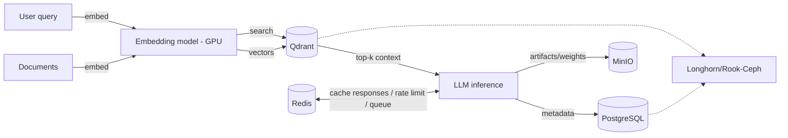

# 04 — Data & State

Durable and fast state for AI workloads: vector storage for retrieval, and an
in-memory layer for cache/queue/pub-sub.

| Component | What it does | File |
|-----------|--------------|------|
| **Qdrant** | Vector database for RAG / semantic search | [qdrant.md](qdrant.md) |
| **Redis** | Cache, queue/broker, pub/sub, session store | [redis.md](redis.md) |
| **PostgreSQL** | Relational backing store (via CloudNativePG) | [postgresql.md](postgresql.md) |
| **MinIO** | S3-compatible object storage for artifacts/weights | [minio.md](minio.md) |
| **ClickHouse** | Columnar analytics store (Langfuse dependency) | [clickhouse.md](clickhouse.md) |
| **Longhorn / Rook-Ceph** | Distributed block storage for PVCs | [storage.md](storage.md) |

## Role in a RAG / agent flow

- **Qdrant** is the long-term semantic memory (embeddings + metadata + filtering).
- **Redis** is the fast, ephemeral layer many other components also depend on
  ([LiveKit](../02-networking-connectivity/livekit.md),
  [Langfuse](../03-observability-llmops/langfuse.md)).
- **PostgreSQL** (via [CloudNativePG](postgresql.md)) and **MinIO**
  back Langfuse/MLflow/Grafana with relational and object storage.
- **ClickHouse** is Langfuse's analytics store; **Longhorn/Rook-Ceph** gives any
  of the above replicated PVCs on bare metal.
