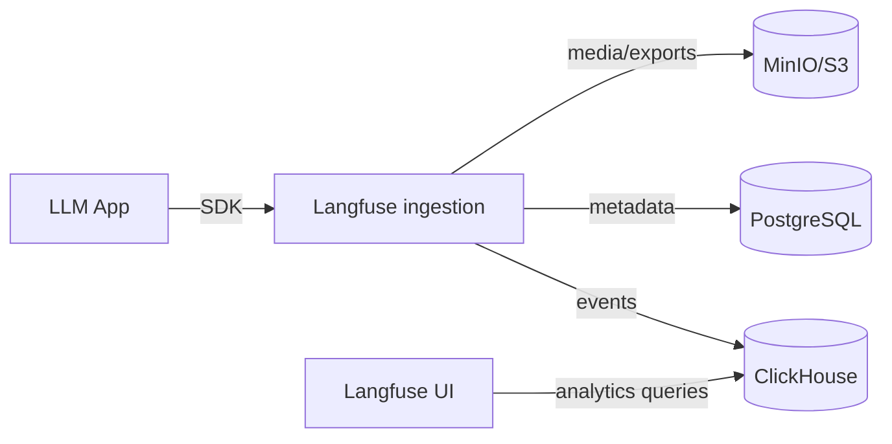

# ClickHouse

> Columnar analytics database required by
> **[Langfuse](../03-observability-llmops/langfuse.md)** for trace/observation
> analytics — one of Langfuse's four required data stores.

- **Category:** Data & State
- **Website:** <https://clickhouse.com>
- **Built with:** C++
- **License:** Apache-2.0

---

## 1. What it is

ClickHouse is a column-oriented OLAP database built for very fast aggregate
queries over huge volumes of append-mostly data — the opposite workload shape from
Postgres's row-oriented OLTP. It's the analytics engine Langfuse uses to query
millions of LLM trace/observation events efficiently.

## 2. What it's used for

- **[Langfuse](../03-observability-llmops/langfuse.md)** — stores and aggregates
  trace, span, and observation events (cost, latency, token usage) for the
  Langfuse UI's analytics views. Required by the Langfuse chart — Langfuse will
  not run without it.

## 3. Architecture



## 4. Dependencies

- **Persistent storage** — a PVC for ClickHouse data parts.
- Only used here as a dependency of [Langfuse](../03-observability-llmops/langfuse.md)
  — no standalone use case in this stack.

## 5. How to use

```sh
helm repo add bitnami https://charts.bitnami.com/bitnami
helm install clickhouse bitnami/clickhouse -n langfuse \
  --set auth.password='<from-openbao>'
```

### Point Langfuse at it
```yaml
# langfuse values.yaml
clickhouse:
  host: clickhouse.langfuse.svc
  port: 9000
  user: default
  password: <from-openbao>
```

## 6. How it's used here

- Deployed strictly as a **Langfuse dependency** in the same namespace, alongside
  [PostgreSQL](postgresql.md), [Redis](redis.md), and [MinIO](minio.md) —
  Langfuse needs all four data stores per its own docs.

## 7. Gotchas

- ClickHouse is not a general-purpose OLTP replacement for Postgres — don't route
  transactional writes to it.
- Sizing matters: retention of raw trace events grows fast under real LLM traffic;
  plan storage and consider Langfuse's data-retention settings.
- Single-node ClickHouse is a SPOF for Langfuse analytics — use a replicated setup
  if Langfuse uptime matters.
