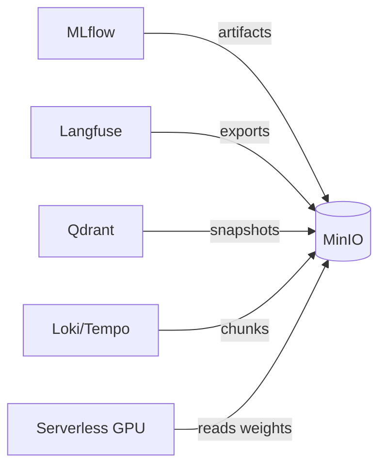

# MinIO — S3-compatible object storage

> On-prem/bare-metal object storage for **MLflow artifacts**, **Langfuse**
> exports, **Qdrant** snapshots, **Loki/Tempo** chunks, and **model weights** for
> [Serverless GPU](../06-gpu-compute/serverless-gpu.md).

- **Category:** Data & State
- **Website:** <https://min.io>
- **Built with:** Go
- **License:** AGPL-3.0

---

## 1. What it is

MinIO is a high-performance, S3-API-compatible object store you can run yourself.
Anything written for AWS S3 (SDKs, `mc`/`aws` CLI, backup tools) works against it
unmodified, making it the standard choice for on-prem "S3" in a Kubernetes cluster.

> **The platform already runs an S3-compatible store** — the
> [PostgreSQL / CNPG](postgresql.md) setup deploys **SeaweedFS** (a lighter-weight alternative to MinIO) for CNPG's WAL/backup
> storage. MinIO is documented here as the more common choice for **app-level**
> object storage (MLflow artifacts, Langfuse exports, model weights) — either can
> serve any S3-compatible consumer.

## 2. What it's used for

- **[MLflow](../03-observability-llmops/mlflow.md)** artifact store (models, plots, files).
- **[Langfuse](../03-observability-llmops/langfuse.md)** media/export storage.
- **[Qdrant](qdrant.md)** snapshot backups.
- **[Loki/Tempo](../03-observability-llmops/loki-tempo.md)** chunk/block storage at scale.
- **Model weights** consumed by [Serverless GPU](../06-gpu-compute/serverless-gpu.md).

## 3. Architecture



## 4. Dependencies

- **Persistent storage** — PVC(s) per node/drive, or
  [Longhorn/Rook-Ceph](storage.md) underneath for replicated durability.
- **[OpenBao](../05-security-secrets/openbao.md)** for access/secret key management.

## 5. How to use

```sh
helm repo add minio https://charts.min.io
helm install minio minio/minio -n storage --create-namespace \
  --set persistence.size=100Gi \
  --set rootUser=admin --set rootPassword='<from-openbao>'
```

### Create a bucket + point an app at it
```sh
mc alias set local http://minio.storage:9000 admin '<password>'
mc mb local/mlflow-artifacts
```
```yaml
# MLflow values.yaml
artifactRoot: s3://mlflow-artifacts/
env:
  MLFLOW_S3_ENDPOINT_URL: http://minio.storage:9000
```

## 6. How it's used here

- Backs artifact/export/snapshot storage for MLflow, Langfuse, and Qdrant.
- Complements the SeaweedFS instance in the [PostgreSQL / CNPG](postgresql.md) setup, which is
  scoped specifically to Postgres backups — keep the two workloads separate so a
  backup-storage outage doesn't take down app artifact access.

## 7. Gotchas

- AGPL-3.0 licensing matters if you redistribute a modified MinIO.
- Single-node MinIO is a SPOF — use MinIO's **distributed mode** (4+ drives/nodes)
  or back it with [Longhorn/Rook-Ceph](storage.md) for real durability.
- Bucket policies default to private — apps need explicit access/secret keys, not
  anonymous access.
