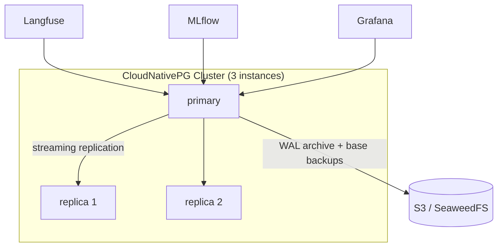

# PostgreSQL

> Shared relational backing store used by **Langfuse**, **MLflow**,
> **Grafana (HA)**, and **Headscale (HA)**. Run via an operator
> (CloudNativePG) for HA, backups, and failover rather than a single pod.

- **Category:** Data & State
- **Website:** <https://postgresql.org> · <https://cloudnative-pg.io>
- **Built with:** C (Postgres) / Go (CloudNativePG operator)
- **License:** PostgreSQL License / Apache-2.0 (CloudNativePG)

---

## 1. What it is

PostgreSQL is the relational database backing several components in this stack.
Rather than a single unmanaged pod, it's run through an **operator** —
**CloudNativePG (CNPG)** — which manages replication, failover, backups, and
rolling upgrades via a `Cluster` CRD.

> **This is already implemented in the platform** — a 3-instance CloudNativePG
> cluster with continuous WAL archiving to a self-hosted S3 store (SeaweedFS).

## 2. What it's used for

- **[Langfuse](../03-observability-llmops/langfuse.md)** — traces/observations metadata.
- **[MLflow](../03-observability-llmops/mlflow.md)** — experiment tracking store.
- **[Grafana](../03-observability-llmops/grafana.md)** — HA backend (replaces default SQLite).
- **[Headscale](../02-networking-connectivity/headscale-operator.md)** — HA control-plane store.

## 3. Architecture



## 4. Dependencies

- **CloudNativePG operator** installed cluster-wide before any `Cluster` CR.
- **S3-compatible object storage** ([MinIO](minio.md) or the platform's SeaweedFS) for
  backup/WAL archiving.
- **[OpenBao](../05-security-secrets/openbao.md)** — recommended for dynamic,
  auto-rotated DB credentials instead of static passwords.

## 5. How to use

### Install the operator (one-time, cluster-wide)
```sh
kubectl apply --server-side -f \
  https://raw.githubusercontent.com/cloudnative-pg/cloudnative-pg/release-1.29/releases/cnpg-1.29.2.yaml
```

### Deploy a cluster
Create a `Cluster` CR (instance count, storage, backup target) plus a
`ScheduledBackup` — see the [CloudNativePG docs](https://cloudnative-pg.io/documentation/).
The platform's manifest set covers the namespace, SeaweedFS credentials/storage,
app/backup credentials, the cluster, and scheduled backups.

## 6. How it's used here

- The platform runs a 3-instance CNPG cluster, backups to SeaweedFS, and a
  scheduled nightly backup job.
- Any app in this stack needing Postgres (Langfuse, MLflow, Grafana) should point
  at the cluster's app-credentials Secret.

## 7. Gotchas

- Don't run a bare Postgres `Deployment` for anything but throwaway dev — no
  failover, no backups, no rolling upgrades.
- Backup credentials and app credentials are separate Secrets — keep them that
  way (least privilege).
- Changing the two S3 access keys must be kept in sync between the SeaweedFS
  credentials and the CNPG backup credentials.
