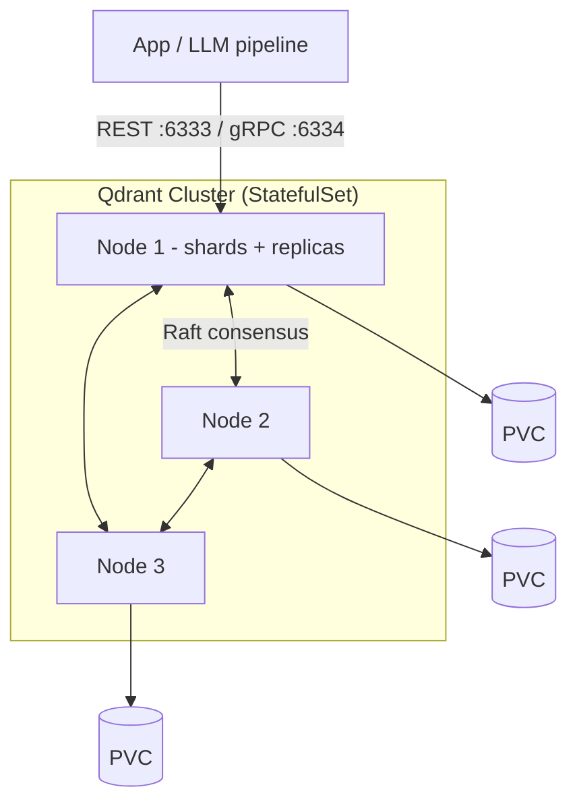

# Qdrant

> High-performance open-source **vector database** for similarity search — the
> retrieval backbone of RAG and semantic search.

- **Category:** Data & State
- **Website:** <https://qdrant.tech>
- **Built with:** Rust
- **License:** Apache-2.0

---

## 1. What it is

Qdrant stores **vectors** (embeddings) alongside a JSON **payload** (metadata) and
serves fast **approximate nearest-neighbor (ANN)** search using the HNSW index.
You query with a vector and optional metadata filters, and it returns the most
semantically similar items. It exposes REST and gRPC APIs and has first-class
client SDKs.

## 2. What it's used for

- **RAG retrieval** — find the top-k most relevant document chunks for a query.
- **Semantic / hybrid search** — dense vectors + payload filters (+ sparse vectors
  for keyword hybrid).
- **Recommendations & deduplication** — nearest-neighbor over item embeddings.
- **Long-term agent memory** — persist and recall embedded context.

## 3. Architecture



- **Collections** hold points (id + vector(s) + payload); **shards** partition a
  collection; **replicas** provide HA.
- Distributed mode uses **Raft** for cluster metadata consensus; deployed as a
  **StatefulSet** with per-node persistent volumes.

## 4. Dependencies

- **Persistent storage** — a fast (SSD/NVMe) `StorageClass`; one PVC per node.
- **Memory** — HNSW indexes are RAM-sensitive; size nodes to hold hot indexes
  (or enable on-disk/quantization to trade recall for RAM).
- **Object storage (optional)** — S3/MinIO for snapshots/backups.
- Optional API key/TLS; commonly fronted by [Istio](../02-networking-connectivity/istio.md).

## 5. How to use

### Deploy (Helm)
```sh
helm repo add qdrant https://qdrant.to/helm
helm install qdrant qdrant/qdrant -n data --create-namespace \
  --set replicaCount=3 \
  --set persistence.size=100Gi
```

### Create a collection & upsert (REST)
```sh
curl -X PUT localhost:6333/collections/docs \
  -H 'content-type: application/json' \
  -d '{"vectors": {"size": 1536, "distance": "Cosine"}}'

curl -X PUT localhost:6333/collections/docs/points \
  -H 'content-type: application/json' \
  -d '{"points":[{"id":1,"vector":[...],"payload":{"src":"handbook"}}]}'
```

### Search with a filter (Python)
```python
from qdrant_client import QdrantClient
c = QdrantClient(url="http://qdrant.data.svc:6333")
c.search(
    collection_name="docs",
    query_vector=embed(query),
    query_filter={"must": [{"key": "src", "match": {"value": "handbook"}}]},
    limit=5,
)
```

## 6. How it's used here

- **Vector memory for RAG** — embeddings produced on
  [Serverless GPU](../06-gpu-compute/serverless-gpu.md) are stored and searched here,
  feeding context to the LLM.
- Snapshots backed up to the shared MinIO/S3;
  access secured via [Istio](../02-networking-connectivity/istio.md) mTLS + API key
  from [OpenBao](../05-security-secrets/openbao.md).

## 7. Gotchas

- Vector **dimension** and **distance metric** are fixed per collection — match
  your embedding model exactly (e.g. 1536 / Cosine).
- Under-provisioned RAM → slow or OOM search; use **quantization** (scalar/binary)
  for large collections.
- For HA, set **replication factor ≥ 2** and spread shards across nodes; a single
  replica loses data if its node dies.
