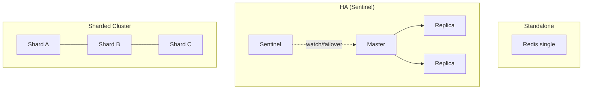

# Redis

> In-memory data store used as a **cache, message broker/queue, pub/sub bus, and
> session store**. The fast shared-state layer many components depend on.

- **Category:** Data & State
- **Website:** <https://redis.io> (see also the Valkey fork)
- **Built with:** C
- **License:** RSALv2/SSPLv1 (Redis 7.4+) — the OSS **Valkey** fork is BSD-3-Clause

---

## 1. What it is

Redis keeps data in RAM (with optional persistence) for sub-millisecond access. It
supports rich data types (strings, hashes, lists, sets, sorted sets, streams,
HyperLogLog, bitmaps) and primitives for caching, queuing, locking, rate limiting,
and pub/sub. It runs standalone, as replicated master/replica with **Sentinel**, or
as a sharded **Redis Cluster**.

## 2. What it's used for (in this platform)

- **Cache** — memoize embeddings, LLM responses, and expensive query results.
- **Queue / broker** — background jobs and worker fan-out
  (e.g. [Langfuse](../03-observability-llmops/langfuse.md) web→worker).
- **Coordination** — multi-node room/participant routing for
  [LiveKit](../02-networking-connectivity/livekit.md).
- **Rate limiting & locks** — protect model endpoints and enforce quotas.
- **Pub/Sub & Streams** — event fan-out between services.
- **Session/state store** — short-lived agent/session context.

## 3. Deployment topologies



| Topology | When |
|----------|------|
| **Standalone** | Dev / small cache; single point of failure |
| **Sentinel (master + replicas)** | HA with automatic failover; dataset fits one node |
| **Cluster (sharded)** | Dataset/throughput exceeds one node |

## 4. Dependencies

- **Persistence (optional)** — RDB snapshots and/or AOF log on a PVC if data must
  survive restarts (pure cache can run without persistence).
- **Memory sizing + `maxmemory-policy`** — e.g. `allkeys-lru` for a cache.
- **Auth/TLS** — set `requirepass`/ACLs; enable TLS in shared clusters.

## 5. How to use

### Deploy (Helm — Bitnami)
```sh
helm repo add bitnami https://charts.bitnami.com/bitnami
helm install redis bitnami/redis -n data --create-namespace \
  --set architecture=replication \
  --set auth.password='<from-openbao>' \
  --set master.persistence.size=8Gi
```
> For a strict-OSS license, use the **Valkey** chart (`bitnami/valkey`) as a drop-in.

### Connect & basic ops
```sh
kubectl port-forward svc/redis-master 6379:6379 -n data
redis-cli -a <password>
> SET session:42 "ctx" EX 3600      # value with 1h TTL
> LPUSH jobs "task1"                 # queue push
> XADD events * type turn user 42    # stream append
> SUBSCRIBE notifications
```

### Point apps at it
```
redis://:<password>@redis-master.data.svc:6379/0
```

## 6. How it's used here

- **Shared fast layer** consumed by LiveKit, Langfuse, and app-level caches/rate
  limiters. Consider **one HA Redis** for shared use, or dedicated instances if you
  need isolation.
- Password/ACLs sourced from [OpenBao](../05-security-secrets/openbao.md).

## 7. Gotchas

- **Licensing:** Redis 7.4+ is RSALv2/SSPL. If you need permissive OSS, use **Valkey**.
- Set `maxmemory` + an eviction policy — an unbounded cache will OOM the pod.
- Sentinel/Cluster clients must be **topology-aware**; a plain client pointed at a
  replica can fail writes after failover.
- Don't treat Redis as your only copy of critical data unless persistence + HA are on.
