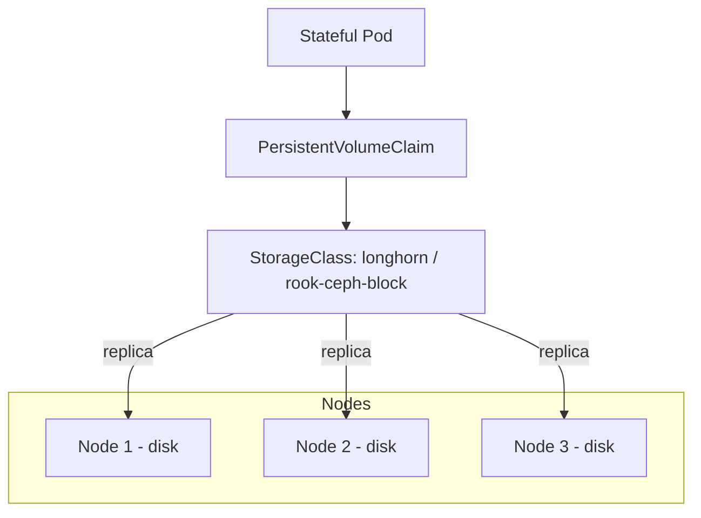

# Longhorn / Rook-Ceph — Distributed Block Storage

> A replicated `StorageClass` so stateful workloads ([Qdrant](qdrant.md),
> [PostgreSQL](postgresql.md), [ClickHouse](clickhouse.md),
> [OpenBao](../05-security-secrets/openbao.md)) survive node failure — important on
> multi-node bare metal without cloud block storage.

- **Category:** Data & State
- **Website:** <https://longhorn.io> · <https://rook.io>
- **Built with:** Go
- **License:** Apache-2.0

---

## 1. What it is

On cloud providers, `PersistentVolumeClaim`s are backed by EBS/PD-style replicated
block storage automatically. On self-managed bare metal there's no equivalent —
without one, a PVC is just a local disk on whichever node the pod landed on, and
losing that node loses the data. **Longhorn** and **Rook-Ceph** both provide a
`StorageClass` whose volumes are replicated across nodes:

- **Longhorn** — simpler, lightweight, replicates each volume across N nodes.
  Easier to operate for small/medium clusters.
- **Rook-Ceph** — operator for Ceph, a mature distributed storage system offering
  block (RBD), object (RGW, S3-compatible), and filesystem (CephFS). More
  powerful, more operational overhead.

## 2. What it's used for

- Replicated `PersistentVolume`s for every stateful component that shouldn't lose
  data if one node goes down: [Qdrant](qdrant.md), [PostgreSQL](postgresql.md)
  (in addition to CNPG's own replication), [ClickHouse](clickhouse.md),
  [OpenBao](../05-security-secrets/openbao.md) Raft storage, [MinIO](minio.md).
- Rook-Ceph can additionally replace MinIO entirely (its RGW component is S3-compatible).

## 3. Architecture



## 4. Dependencies

- **Raw/unused disks or partitions** on each node (Rook-Ceph typically wants
  dedicated block devices; Longhorn can use a directory on the existing filesystem).
- **Open node-to-node connectivity** for replication traffic.

## 5. How to use

### Longhorn (simpler)
```sh
helm repo add longhorn https://charts.longhorn.io
helm install longhorn longhorn/longhorn -n longhorn-system --create-namespace
kubectl patch storageclass longhorn -p '{"metadata":{"annotations":{"storageclass.kubernetes.io/is-default-class":"true"}}}'
```

### Rook-Ceph (more capable, more ops)
```sh
helm repo add rook-release https://charts.rook.io/release
helm install rook-ceph rook-release/rook-ceph -n rook-ceph --create-namespace
```

### Use it
```yaml
apiVersion: v1
kind: PersistentVolumeClaim
metadata: { name: qdrant-data }
spec:
  storageClassName: longhorn   # or rook-ceph-block
  accessModes: ["ReadWriteOnce"]
  resources: { requests: { storage: 50Gi } }
```

## 6. How it's used here

- The `StorageClass` every PVC in this stack should target on bare metal, instead
  of relying on single-node `hostPath`/local-path storage that can't survive node
  loss — most relevant for [Qdrant](qdrant.md), [ClickHouse](clickhouse.md), and
  [OpenBao](../05-security-secrets/openbao.md).
- [CNPG](postgresql.md) already replicates at the Postgres layer;
  putting its PVCs on Longhorn/Rook-Ceph adds an extra layer of disk-level redundancy.

## 7. Gotchas

- Both add real overhead (network replication traffic, CPU/RAM for OSDs in Ceph's
  case) — don't add a distributed storage layer under a single-node dev cluster.
- Rook-Ceph generally wants dedicated raw disks, not partitions on the OS drive.
- Pick one, not both — running Longhorn and Rook-Ceph together adds complexity for
  no benefit.
