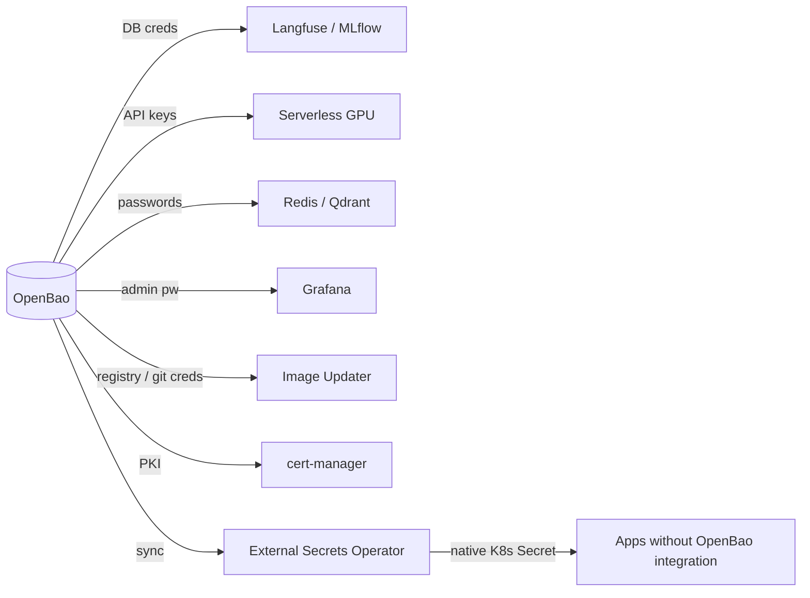

# 05 — Security & Secrets

Centralized secrets management and encryption-as-a-service for the whole platform.

| Component | What it does | File |
|-----------|--------------|------|
| **OpenBao** | Secrets store, dynamic credentials, encryption API | [openbao.md](openbao.md) |
| **cert-manager** | Automated TLS certificate issuance & renewal | [cert-manager.md](cert-manager.md) |
| **External Secrets Operator** | Syncs OpenBao secrets → native K8s Secrets | [external-secrets.md](external-secrets.md) |

## Where secrets flow

Every other component should pull its credentials from OpenBao (via the
Vault/OpenBao Secrets Operator, Agent injector, or [External Secrets Operator](external-secrets.md))
instead of hardcoding them in `values.yaml`. [cert-manager](cert-manager.md) can
issue internal PKI certs from OpenBao's PKI engine.
