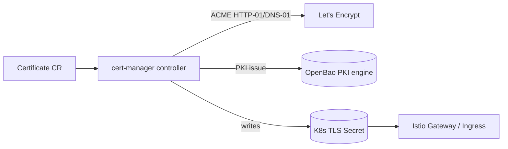

# cert-manager

> Automated **TLS certificate** issuance and renewal as Kubernetes resources.
> Required for real TLS on [Istio](../02-networking-connectivity/istio.md)
> gateways, [LiveKit](../02-networking-connectivity/livekit.md),
> [Headscale](../02-networking-connectivity/headscale-operator.md), and
> [OpenBao](openbao.md).

- **Category:** Security & Secrets
- **Website:** <https://cert-manager.io>
- **Built with:** Go
- **License:** Apache-2.0

---

## 1. What it is

cert-manager adds Kubernetes CRDs (`Certificate`, `Issuer`/`ClusterIssuer`) and a
controller that requests, renews, and stores TLS certificates as Secrets — from
**Let's Encrypt** (ACME), an internal CA, or **OpenBao's PKI engine**. It
auto-renews before expiry so certificates never silently go stale.

## 2. What it's used for

- **Public TLS** — ACME/Let's Encrypt certs for internet-facing Istio gateways.
- **Internal mTLS/PKI** — issuing certs from an internal or OpenBao-backed CA for
  service-to-service or admin UI TLS.
- **Automatic renewal** — no manual cert rotation ops burden.

## 3. Architecture



## 4. Dependencies

- **An Issuer backend** — ACME (needs a reachable HTTP-01 or DNS-01 challenge path,
  i.e. [MetalLB + Ingress](../02-networking-connectivity/metallb-ingress.md) or a
  DNS provider API token) or [OpenBao](openbao.md) PKI.
- **CRDs** installed alongside the controller (`crds.enabled=true`).

## 5. How to use

```sh
helm repo add jetstack https://charts.jetstack.io
helm install cert-manager jetstack/cert-manager \
  -n cert-manager --create-namespace --set crds.enabled=true
```

### ClusterIssuer (Let's Encrypt via HTTP-01)
```yaml
apiVersion: cert-manager.io/v1
kind: ClusterIssuer
metadata: { name: letsencrypt-prod }
spec:
  acme:
    server: https://acme-v02.api.letsencrypt.org/directory
    email: ops@example.com
    privateKeySecretRef: { name: letsencrypt-prod }
    solvers:
      - http01: { ingress: { class: nginx } }
```

### Request a certificate
```yaml
apiVersion: cert-manager.io/v1
kind: Certificate
metadata: { name: istio-gw-tls, namespace: istio-system }
spec:
  secretName: istio-gw-tls
  issuerRef: { name: letsencrypt-prod, kind: ClusterIssuer }
  dnsNames: ["api.example.com"]
```

## 6. How it's used here

- Issues public TLS for [Istio](../02-networking-connectivity/istio.md) gateways
  fronting user-facing services.
- Can be pointed at [OpenBao's](openbao.md) PKI engine as an internal `Issuer` for
  mesh-internal certs instead of (or alongside) Istio's own mTLS.

## 7. Gotchas

- ACME HTTP-01 challenges need a reachable path from Let's Encrypt — on bare metal
  this means [MetalLB + Ingress](../02-networking-connectivity/metallb-ingress.md)
  set up first; use DNS-01 if the cluster isn't publicly reachable.
- Rate limits on Let's Encrypt production apply — use the staging issuer while testing.
- `ClusterIssuer` is cluster-scoped; make sure only trusted namespaces can create
  `Certificate` resources referencing it.
