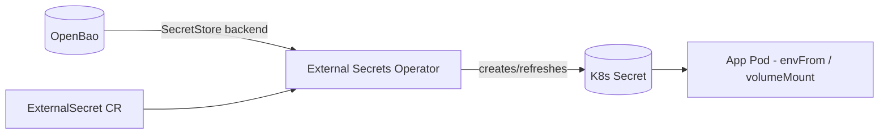

# External Secrets Operator

> Alternative/complement to the OpenBao Secrets Operator: syncs secrets from
> [OpenBao](openbao.md) into native Kubernetes `Secret` objects any pod can mount,
> without app changes.

- **Category:** Security & Secrets
- **Website:** <https://external-secrets.io>
- **Built with:** Go
- **License:** Apache-2.0

---

## 1. What it is

External Secrets Operator (ESO) adds an `ExternalSecret` CRD that pulls values
from an external secret store (OpenBao/Vault, AWS Secrets Manager, and many more)
and materializes them as regular Kubernetes `Secret` resources — kept in sync on a
refresh interval.

## 2. What it's used for

- Giving apps that only know how to consume **native Kubernetes Secrets** (env
  vars, volume mounts) access to secrets that actually live in
  [OpenBao](openbao.md), without any app-side OpenBao integration.
- A single, uniform way to sync secrets if multiple backends are ever used
  (OpenBao today, cloud secret managers later).

## 3. Architecture



## 4. Dependencies

- **[OpenBao](openbao.md)** (or another supported backend) as the actual secret
  store — ESO does not store secrets itself.
- **Auth to the backend** — a Kubernetes auth role/token ESO uses to read OpenBao.

## 5. How to use

```sh
helm repo add external-secrets https://charts.external-secrets.io
helm install external-secrets external-secrets/external-secrets \
  -n external-secrets --create-namespace
```

### SecretStore pointing at OpenBao
```yaml
apiVersion: external-secrets.io/v1beta1
kind: SecretStore
metadata: { name: openbao-backend, namespace: langfuse }
spec:
  provider:
    vault:
      server: "http://openbao.openbao:8200"
      path: kv
      version: v2
      auth:
        kubernetes: { mountPath: kubernetes, role: langfuse }
```

### ExternalSecret → K8s Secret
```yaml
apiVersion: external-secrets.io/v1beta1
kind: ExternalSecret
metadata: { name: langfuse-db, namespace: langfuse }
spec:
  secretStoreRef: { name: openbao-backend, kind: SecretStore }
  target: { name: langfuse-db }
  data:
    - secretKey: password
      remoteRef: { key: langfuse/postgres, property: password }
```

## 6. How it's used here

- Preferred sync path when a component only supports plain K8s Secrets/env vars —
  keeps [OpenBao](openbao.md) as the single source of truth while apps stay
  unaware of it.
- Complements (doesn't replace) the OpenBao Agent Injector, which is better suited
  for sidecar-injected, in-memory-only secrets.

## 7. Gotchas

- Refresh interval means a rotated secret in OpenBao isn't instant in the pod —
  pods must also be restarted/reloaded to pick up a changed `Secret` (unless the
  app hot-reloads mounted files).
- The resulting `Secret` is a plain Kubernetes object at rest — combine with
  encryption-at-rest (KMS provider for etcd) for defense in depth.
