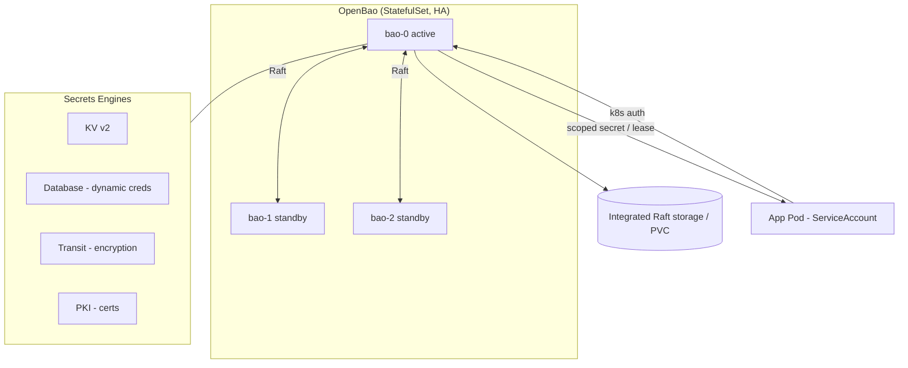

# OpenBao

> Open-source **secrets management** and encryption platform — a community fork of
> HashiCorp Vault, governed by the Linux Foundation.

- **Category:** Security & Secrets
- **Website:** <https://openbao.org>
- **Built with:** Go
- **License:** MPL-2.0 (LF Edge / OpenSSF Sandbox project)

---

## 1. What it is

OpenBao stores, generates, and controls access to **secrets** (API keys, DB
passwords, certificates, encryption keys). It exposes an API where every secret is
path-addressed, access is policy-controlled, and everything is audited. It began as
a fork of Vault after Vault's license change, keeping an open-source (MPL-2.0) core
with a compatible API.

## 2. What it's used for

- **Static secrets** — KV store for tokens, passwords, config secrets.
- **Dynamic secrets** — generate short-lived, on-demand DB/cloud credentials that
  auto-expire (no long-lived shared passwords).
- **Encryption as a service** (transit engine) — apps send plaintext, OpenBao
  returns ciphertext; keys never leave the vault.
- **PKI / certificates** — issue and rotate internal TLS certs.
- **Kubernetes-native auth** — pods authenticate with their ServiceAccount token
  and receive scoped secrets.

## 3. Architecture



- **Sealed by default** — starts sealed; needs **unseal keys** (Shamir shares) or an
  auto-unseal (KMS/transit) to become operational.
- **Integrated storage (Raft)** — built-in HA storage, no external DB needed.
- **Auth methods** (Kubernetes, AppRole, JWT/OIDC) + **policies** (path-scoped RBAC)
  gate every request.

## 4. Dependencies

- **Persistent storage** — a PVC per replica for Raft data.
- **Unseal strategy** — Shamir (manual) or auto-unseal via a cloud KMS / transit key.
- **TLS** — should terminate TLS ([cert-manager](cert-manager.md)).
- **Consumer integration** — one of:
  - **OpenBao/Vault Secrets Operator** (syncs secrets → native K8s Secrets),
  - **Agent Injector** (sidecar writes secrets into the pod), or
  - **External Secrets Operator**.

## 5. How to use

### Deploy (Helm)
```sh
helm repo add openbao https://openbao.github.io/openbao-helm
helm install openbao openbao/openbao -n openbao --create-namespace \
  --set server.ha.enabled=true \
  --set server.ha.raft.enabled=true
```

### Initialize & unseal
```sh
kubectl exec -n openbao openbao-0 -- bao operator init      # prints unseal keys + root token (store SAFELY)
kubectl exec -n openbao openbao-0 -- bao operator unseal <key-share>   # repeat with threshold shares
```

### Enable engines & write a secret
```sh
bao secrets enable -path=kv kv-v2
bao kv put kv/langfuse/postgres username=lf password=<generated>
bao kv get kv/langfuse/postgres
```

### Kubernetes auth + policy
```sh
bao auth enable kubernetes
bao policy write langfuse-ro - <<'EOF'
path "kv/data/langfuse/*" { capabilities = ["read"] }
EOF
bao write auth/kubernetes/role/langfuse \
  bound_service_account_names=langfuse \
  bound_service_account_namespaces=langfuse \
  policies=langfuse-ro ttl=1h
```

### Consume from a pod (Secrets Operator CR)
```yaml
apiVersion: secrets.openbao.org/v1beta1
kind: SecretSync           # syncs kv/langfuse/postgres -> a K8s Secret
metadata: { name: langfuse-db, namespace: langfuse }
spec:
  mount: kv
  path: langfuse/postgres
  destination: { name: langfuse-db, create: true }
```

## 6. How it's used here

- **Single source of truth for secrets** — every component (Langfuse, MLflow, Redis,
  Qdrant, Grafana, Image Updater, SSH keys) pulls credentials from OpenBao instead
  of committing them to Git.
- Enables **dynamic DB credentials** so PostgreSQL/ClickHouse passwords are
  short-lived and auto-rotated.

## 7. Gotchas — critical

- **Back up the unseal keys and Raft storage.** Lose the unseal keys → the vault is
  unrecoverable. Never commit the root token.
- Prefer **auto-unseal** in production so pods can restart without manual unsealing.
- Scope policies tightly (least privilege) and enable the **audit device** for a
  tamper-evident log.
- Rotate the initial root token after setup; use short TTLs on roles.
