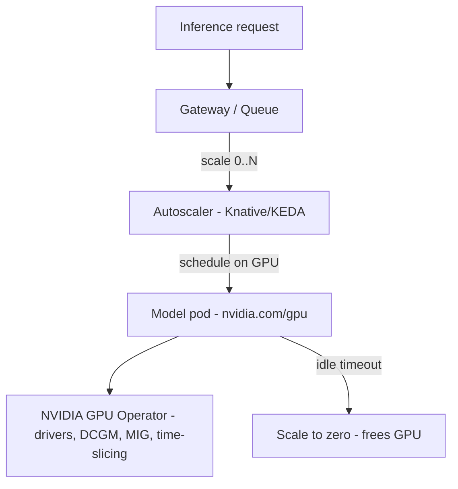

# 06 — GPU & Compute

The heart of the AI platform: turning pooled multi-node GPUs into on-demand,
scale-to-zero inference capacity.

| Component | What it does | File |
|-----------|--------------|------|
| **NVIDIA GPU Operator** | Drivers, device plugin, DCGM metrics, MIG/time-slicing | [gpu-operator.md](gpu-operator.md) |
| **Knative / KEDA** | Scale-to-zero autoscaling | [autoscaling.md](autoscaling.md) |
| **Serverless GPU** | On-demand, autoscaling, scale-to-zero GPU inference | [serverless-gpu.md](serverless-gpu.md) |

> Serverless GPU depends heavily on the **NVIDIA GPU Operator** and an
> **autoscaler** (Knative/KEDA) — see [gpu-operator.md](gpu-operator.md) and
> [autoscaling.md](autoscaling.md).

