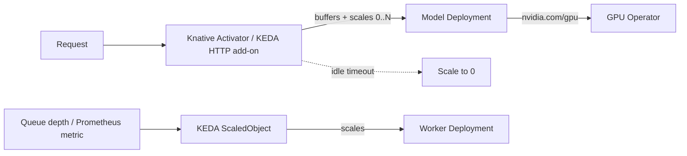

# Knative Serving / KEDA — Autoscaling

> The scale-to-zero engine behind [Serverless GPU](serverless-gpu.md). Without an
> autoscaler, GPU pods run 24/7 regardless of traffic.

- **Category:** GPU & Compute
- **Website:** <https://knative.dev> · <https://keda.sh>
- **Built with:** Go
- **License:** Apache-2.0 (both)

---

## 1. What it is

Two complementary autoscalers, either (or both) of which can drive GPU workloads
to zero when idle:

- **Knative Serving** — request-driven autoscaling (KPA). Wraps a Deployment with
  an activator/queue-proxy that buffers requests while cold-starting, and scales
  purely on concurrent request count. Native scale-to-zero.
- **KEDA** — event/metric-driven autoscaling (queue depth, Prometheus metrics,
  cron, 60+ scalers). Its **HTTP add-on** gives KEDA request-based scale-to-zero
  similar to Knative.

## 2. What it's used for

- Scaling [Serverless GPU](serverless-gpu.md) model pods from **0 to N** based on
  incoming inference traffic, and back to **0** when idle to free the GPU.
- KEDA additionally scales workers based on **queue depth** (e.g. a Redis-backed
  job queue) or custom Prometheus metrics, not just HTTP.

## 3. Architecture



## 4. Dependencies

- **[NVIDIA GPU Operator](gpu-operator.md)** — GPUs must be schedulable before the
  autoscaler can place pods on them.
- **[Prometheus](../03-observability-llmops/prometheus.md)** — metric source for
  KEDA's Prometheus scaler.
- **Ingress/mesh** — Knative typically fronts services with its own Kourier/Istio
  networking layer; KEDA's HTTP add-on needs an interceptor deployed.

## 5. How to use

### Knative Serving
```sh
kubectl apply -f https://github.com/knative/serving/releases/latest/download/serving-crds.yaml
kubectl apply -f https://github.com/knative/serving/releases/latest/download/serving-core.yaml
```
```yaml
apiVersion: serving.knative.dev/v1
kind: Service
metadata: { name: llm-vllm }
spec:
  template:
    metadata:
      annotations:
        autoscaling.knative.dev/minScale: "0"
        autoscaling.knative.dev/maxScale: "8"
    spec:
      containers:
        - image: vllm/vllm-openai:latest
          resources: { limits: { nvidia.com/gpu: "1" } }
```

### KEDA
```sh
helm repo add kedacore https://kedacore.github.io/charts
helm install keda kedacore/keda -n keda --create-namespace
```
```yaml
apiVersion: keda.sh/v1alpha1
kind: ScaledObject
metadata: { name: gpu-worker }
spec:
  scaleTargetRef: { name: gpu-worker-deployment }
  minReplicaCount: 0
  triggers:
    - type: redis
      metadata: { address: redis-master.data.svc:6379, listName: jobs, listLength: "5" }
```

## 6. How it's used here

- Drives replica count for [Serverless GPU](serverless-gpu.md) model services;
  `minScale: 0` frees GPUs between bursts of chat/voice traffic.
- KEDA's queue-based scaling suits background/batch inference fed by
  [Redis](../04-data-state/redis.md) queues.

## 7. Gotchas

- **Cold starts** with large model weights can take tens of seconds — set
  `minScale: 1` for latency-critical paths or warm the cache.
- Knative and KEDA's HTTP add-on overlap in purpose; picking both adds complexity —
  prefer Knative for pure HTTP services, KEDA for everything else (queues, cron,
  custom metrics).
- Autoscaler must not scale up faster than the scheduler can place pods on free GPUs
  — watch for pending pods when all GPUs are busy.
