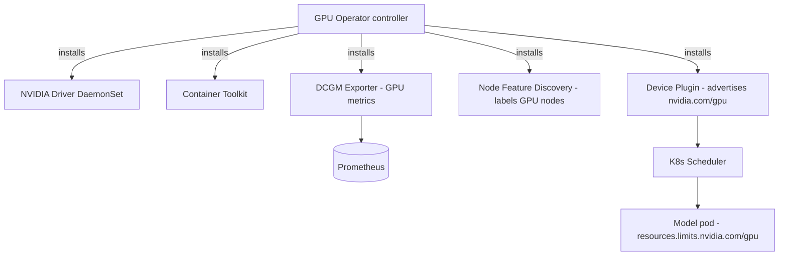

# NVIDIA GPU Operator

> The foundation of everything GPU on this cluster — without it, `nvidia.com/gpu`
> is never schedulable. Automates drivers, container runtime, device plugin, and
> GPU metrics/sharing.

- **Category:** GPU & Compute
- **Website:** <https://github.com/NVIDIA/gpu-operator>
- **Built with:** Go (operator) + Helm
- **License:** Apache-2.0

---

## 1. What it is

The GPU Operator uses the [Operator Framework](https://operatorhub.io) to automate
management of the software components needed to provision GPUs on Kubernetes:
NVIDIA **drivers**, the **container toolkit**, the **Kubernetes device plugin**
(advertises `nvidia.com/gpu` as an allocatable resource), **node feature
discovery** (labels GPU nodes), the **DCGM exporter** (GPU metrics), and
**MIG**/**time-slicing** configuration for sharing a physical GPU across pods.

## 2. What it's used for

- Making `nvidia.com/gpu` schedulable so [Serverless GPU](serverless-gpu.md) pods
  can request GPU resources.
- Feeding **DCGM** GPU utilization/VRAM/temperature/power metrics into
  [Grafana](../03-observability-llmops/grafana.md) (dashboard ID 12239).
- Enabling **MIG** (isolated hardware partitions) or **time-slicing**
  (oversubscription) so multiple small workloads can share one GPU.

## 3. Architecture



## 4. Dependencies

- **Compatible node OS/kernel** for the driver DaemonSet (or pre-installed drivers
  with `driver.enabled=false`).
- **[Prometheus](../03-observability-llmops/prometheus.md)** to scrape DCGM metrics.
- Nothing else — it's typically the **first** thing installed on GPU nodes.

## 5. How to use

```sh
helm repo add nvidia https://helm.ngc.nvidia.com/nvidia
helm install gpu-operator nvidia/gpu-operator \
  -n gpu-operator --create-namespace
```

### Verify GPUs are schedulable
```sh
kubectl get nodes -o json | jq '.items[].status.allocatable["nvidia.com/gpu"]'
```

### Enable time-slicing (share one GPU across N pods)
```yaml
# time-slicing-config ConfigMap, referenced via clusterPolicy.devicePlugin.config
version: v1
sharing:
  timeSlicing:
    resources:
      - name: nvidia.com/gpu
        replicas: 4
```

### Enable MIG (isolated partitions, on supported cards e.g. A100/H100)
```sh
kubectl label node <gpu-node> nvidia.com/mig.config=all-1g.5gb --overwrite
```

## 6. How it's used here

- Prerequisite for [Serverless GPU](serverless-gpu.md) — without it no pod can
  request `nvidia.com/gpu`.
- DCGM metrics flow into [Grafana](../03-observability-llmops/grafana.md) GPU
  dashboards, critical for spotting stragglers/thermal throttling across nodes.

## 7. Gotchas

- Driver install can conflict with a distro's own NVIDIA driver — either let the
  operator manage drivers exclusively, or disable `driver.enabled` and pre-install.
- MIG requires a reboot/reset of the GPU and only works on MIG-capable cards.
- Time-slicing is **not** isolation — a noisy neighbor can still starve others; use
  MIG when hard isolation matters.
