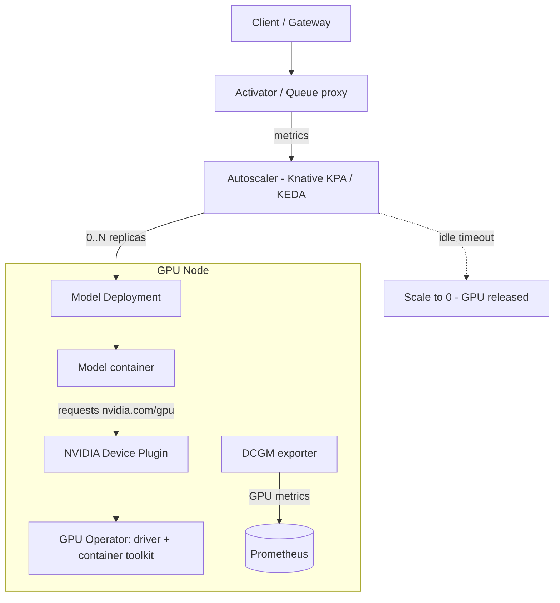

# Serverless GPU

> A pattern/component for running **GPU inference workloads on-demand** with
> **autoscaling and scale-to-zero**, so expensive GPUs are only consumed while
> actually serving requests.

- **Category:** GPU & Compute
- **Typical building blocks:** Knative Serving / KServe / KEDA + NVIDIA GPU Operator
- **Deployed as:** a Helm chart in the platform's deployment repo (`templates/ + Chart.yaml + values.yaml`)

---

## 1. What it is

"Serverless GPU" is the capability to treat GPU compute like a function: a model
service that **spins up when a request arrives, scales out under load, and scales
back to zero when idle** — releasing the GPU for other workloads. On Kubernetes
this is realized by combining a request-aware autoscaler with GPU scheduling.

Because GPUs are the most expensive resource in the cluster, scale-to-zero and bin-
packing are what make a multi-node GPU platform economical.

## 2. What it's used for

- **LLM / embedding / reranker inference** that isn't needed 24/7.
- **Bursty workloads** — batch jobs, spiky chat traffic, voice agents via
  [LiveKit](../02-networking-connectivity/livekit.md).
- **Multi-tenant GPU sharing** — MIG partitioning or time-slicing lets several
  small models share one physical GPU.
- **Cost control** — idle models cost nothing; GPUs are freed automatically.

## 3. Architecture



**Layered stack:**
1. **NVIDIA GPU Operator** — installs drivers, container toolkit, device plugin,
   DCGM metrics, and enables **MIG** / **time-slicing** for GPU sharing.
2. **Scheduler/runtime** — pods request `nvidia.com/gpu`; the device plugin advertises GPUs.
3. **Autoscaler** — **Knative Serving** (KPA, request-based, native scale-to-zero) or
   **KEDA** (event/metric-driven, scale-to-zero via HTTP add-on) drives replica count.
4. **Model server** — vLLM, Triton, TGI, or a custom FastAPI wrapper serving the model.

## 4. Dependencies

| Dependency | Why | Doc |
|------------|-----|-----|
| **NVIDIA GPU Operator** | Drivers, device plugin, DCGM, MIG/time-slicing | [gpu-operator.md](gpu-operator.md) |
| **Autoscaler** (Knative/KEDA) | Request/event-driven scaling incl. scale-to-zero | [autoscaling.md](autoscaling.md) |
| **Object storage / registry** | Pull model weights (MinIO/S3) or images | MinIO / registry |
| **[MLflow](../03-observability-llmops/mlflow.md)** | Source registered model versions | — |
| **[Qdrant](../04-data-state/qdrant.md)** | RAG context for the served model | — |
| **[Redis](../04-data-state/redis.md)** | Response cache / rate limiting | — |
| **[Langfuse](../03-observability-llmops/langfuse.md)** | Trace inference calls | — |

## 5. How to use

### Prerequisite: expose GPUs (GPU Operator)
```sh
helm repo add nvidia https://helm.ngc.nvidia.com/nvidia
helm install gpu-operator nvidia/gpu-operator -n gpu-operator --create-namespace
kubectl get nodes -o json | jq '.items[].status.allocatable["nvidia.com/gpu"]'
```

### Prerequisite: request-based autoscaler (Knative example)
```sh
kubectl apply -f https://github.com/knative/serving/releases/latest/download/serving-crds.yaml
kubectl apply -f https://github.com/knative/serving/releases/latest/download/serving-core.yaml
```

### Deploy a scale-to-zero GPU model (Knative Service)
```yaml
apiVersion: serving.knative.dev/v1
kind: Service
metadata: { name: llm-vllm }
spec:
  template:
    metadata:
      annotations:
        autoscaling.knative.dev/minScale: "0"     # scale to zero when idle
        autoscaling.knative.dev/maxScale: "8"
        autoscaling.knative.dev/target: "5"        # concurrent requests per pod
    spec:
      containers:
        - image: vllm/vllm-openai:latest
          args: ["--model", "meta-llama/Llama-3.1-8B-Instruct"]
          resources:
            limits: { nvidia.com/gpu: "1" }
```

### Deploy the platform's chart
```sh
helm install serverlessgpu ./serverlessgpu -n inference --create-namespace -f values.yaml
```
Key `values.yaml` knobs: `model.uri` (MLflow/S3), `gpu.count`, `gpu.mig` /
`gpu.timeSlicing`, `autoscaling.min/max/target`, `scaleToZero.enabled`.

## 6. How it's used here

- **The compute layer** every AI feature ultimately calls — RAG answers, embeddings,
  and voice-agent inference all land on serverless GPU services.
- Models come from [MLflow](../03-observability-llmops/mlflow.md), context from
  [Qdrant](../04-data-state/qdrant.md), traces to
  [Langfuse](../03-observability-llmops/langfuse.md), GPU metrics to
  [Grafana](../03-observability-llmops/grafana.md).

## 7. Gotchas

- **Cold starts** are real: loading large weights onto a GPU can take tens of
  seconds. Mitigate with `minScale: 1` for latency-critical paths, node-local model
  caches, or warm pools.
- **GPUs aren't natively fractional** — use **MIG** (hardware partitions, isolated)
  or **time-slicing** (oversubscription, not isolated) to share a card.
- **Scheduling waits** — if all GPUs are busy, pods pend. Set requests/limits and
  priorities; watch DCGM metrics for saturation.
- Ensure the model server exposes readiness correctly so the autoscaler doesn't route
  traffic before weights finish loading.
