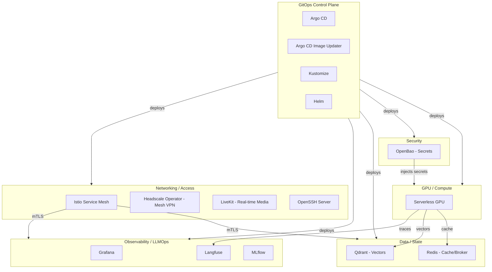

# AI Infra — Enterprise-Grade AI Infrastructure Ecosystem

> Master reference for a self-hosted, enterprise-grade AI platform running on a
> **Kubernetes cluster with a multi-node GPU setup**. Every component below is
> deployed as a **Helm chart** and reconciled via **GitOps** (Argo CD + Argo CD
> Image Updater + Kustomize).

This document is the entry point. Each component has its own deep-dive file,
grouped into functional **classifications** (one folder per classification).

---

## 1. Platform Goal

Build a reproducible, secure, observable AI/LLM platform where:

- **GPU compute** is pooled across multiple nodes and served on-demand (scale-to-zero).
- **Models & agents** (LLM inference, RAG, real-time voice/video) run as services.
- **State** (vectors, cache, metadata, artifacts) is durable and highly available.
- **Everything is declarative** — Git is the source of truth, Helm renders it,
  Argo CD applies it, and Image Updater keeps images fresh.
- **Access & secrets** are zero-trust (mesh VPN + service mesh mTLS + a secrets vault).



---

## 2. Component Classification Map

| # | Classification | Folder | Components |
|---|----------------|--------|------------|
| 1 | Packaging & GitOps | [`01-packaging-gitops/`](01-packaging-gitops/) | Helm, Kustomize, Argo CD, Argo CD Image Updater |
| 2 | Networking & Connectivity | [`02-networking-connectivity/`](02-networking-connectivity/) | Istio, Headscale Operator, LiveKit, OpenSSH Server, MetalLB + Ingress-NGINX |
| 3 | Observability & LLMOps | [`03-observability-llmops/`](03-observability-llmops/) | Grafana, Prometheus, Loki + Tempo, Langfuse, MLflow |
| 4 | Data & State | [`04-data-state/`](04-data-state/) | Qdrant, Redis, PostgreSQL, MinIO, ClickHouse, Longhorn/Rook-Ceph |
| 5 | Security & Secrets | [`05-security-secrets/`](05-security-secrets/) | OpenBao, cert-manager, External Secrets Operator |
| 6 | GPU & Compute | [`06-gpu-compute/`](06-gpu-compute/) | Serverless GPU, NVIDIA GPU Operator, Knative/KEDA |

---

## 3. Component Index (with role)

### 1 — Packaging & GitOps
| Component | Role | File |
|-----------|------|------|
| **Helm** | Package manager; templates K8s manifests into charts | [helm.md](01-packaging-gitops/helm.md) |
| **Kustomize** | Template-free YAML overlay/patching (env-specific config) | [kustomize.md](01-packaging-gitops/kustomize.md) |
| **Argo CD** | GitOps engine — syncs Git to the cluster | [argocd.md](01-packaging-gitops/argocd.md) |
| **Argo CD Image Updater** | Auto-bumps container image tags in Git/Argo CD | [image-updater.md](01-packaging-gitops/image-updater.md) |

### 2 — Networking & Connectivity
| Component | Role | File |
|-----------|------|------|
| **Istio** | Service mesh — mTLS, traffic routing, observability | [istio.md](02-networking-connectivity/istio.md) |
| **Headscale Operator** | Self-hosted Tailscale control plane (mesh VPN) on K8s | [headscale-operator.md](02-networking-connectivity/headscale-operator.md) |
| **LiveKit** | WebRTC SFU for real-time voice/video AI agents | [livekit.md](02-networking-connectivity/livekit.md) |
| **OpenSSH Server** | In-cluster SSH access (dev pods, GPU shells, SFTP) | [openssh-server.md](02-networking-connectivity/openssh-server.md) |
| **MetalLB + Ingress-NGINX** | Bare-metal LoadBalancer IPs & L7 ingress | [metallb-ingress.md](02-networking-connectivity/metallb-ingress.md) |

### 3 — Observability & LLMOps
| Component | Role | File |
|-----------|------|------|
| **Grafana** | Dashboards & visualization for metrics/logs/traces | [grafana.md](03-observability-llmops/grafana.md) |
| **Prometheus** | Metrics time-series store, Grafana's primary source | [prometheus.md](03-observability-llmops/prometheus.md) |
| **Loki + Tempo** | Log aggregation & distributed tracing | [loki-tempo.md](03-observability-llmops/loki-tempo.md) |
| **Langfuse** | LLM tracing, evals, prompt management, cost tracking | [langfuse.md](03-observability-llmops/langfuse.md) |
| **MLflow** | Experiment tracking, model registry, artifacts | [mlflow.md](03-observability-llmops/mlflow.md) |

### 4 — Data & State
| Component | Role | File |
|-----------|------|------|
| **Qdrant** | Vector database for RAG / semantic search | [qdrant.md](04-data-state/qdrant.md) |
| **Redis** | In-memory cache, queue/broker, pub/sub, session store | [redis.md](04-data-state/redis.md) |
| **PostgreSQL** | Relational backing store (via CloudNativePG) | [postgresql.md](04-data-state/postgresql.md) |
| **MinIO** | S3-compatible object storage for artifacts/weights | [minio.md](04-data-state/minio.md) |
| **ClickHouse** | Columnar analytics store (Langfuse dependency) | [clickhouse.md](04-data-state/clickhouse.md) |
| **Longhorn / Rook-Ceph** | Distributed block storage for PVCs | [storage.md](04-data-state/storage.md) |

### 5 — Security & Secrets
| Component | Role | File |
|-----------|------|------|
| **OpenBao** | Secrets management, dynamic creds, encryption-as-a-service | [openbao.md](05-security-secrets/openbao.md) |
| **cert-manager** | Automated TLS certificate issuance & renewal | [cert-manager.md](05-security-secrets/cert-manager.md) |
| **External Secrets Operator** | Syncs OpenBao secrets → native K8s Secrets | [external-secrets.md](05-security-secrets/external-secrets.md) |

### 6 — GPU & Compute
| Component | Role | File |
|-----------|------|------|
| **Serverless GPU** | On-demand, scale-to-zero GPU inference workloads | [serverless-gpu.md](06-gpu-compute/serverless-gpu.md) |
| **NVIDIA GPU Operator** | Drivers, device plugin, DCGM metrics, MIG/time-slicing | [gpu-operator.md](06-gpu-compute/gpu-operator.md) |
| **Knative / KEDA** | Scale-to-zero autoscaling engine | [autoscaling.md](06-gpu-compute/autoscaling.md) |

---

## 4. Standard Chart Layout

Almost every component in this platform follows the same Helm chart structure:

```text
<component>/
├── Chart.yaml          # chart metadata + dependencies (subcharts)
├── values.yaml         # default configuration (overridable per environment)
└── templates/
    ├── deployment.yaml # or statefulset.yaml
    ├── service.yaml
    ├── configmap.yaml
    ├── secret.yaml
    ├── ingress.yaml    # or istio VirtualService / Gateway
    └── _helpers.tpl    # reusable template functions
```

- **`Chart.yaml`** — name, version, `appVersion`, and a `dependencies:` list that
  pulls in subcharts (e.g. Redis, PostgreSQL) from remote Helm repos.
- **`values.yaml`** — the single source of tunable configuration. Environment
  overlays override it via `-f values-prod.yaml` or Kustomize/Argo CD parameters.
- **`templates/*.yaml`** — Go-templated Kubernetes manifests rendered by `helm template`.

See [01-packaging-gitops/helm.md](01-packaging-gitops/helm.md) for the full anatomy.

---

## 5. Dependency Cheat-Sheet

Which components need which backing services (important when ordering deployment):

| Component | PostgreSQL | Redis | ClickHouse | Object Storage (S3/MinIO) | GPU | Notes |
|-----------|:----------:|:-----:|:----------:|:-------------------------:|:---:|-------|
| Langfuse | ✅ | ✅ | ✅ | ✅ | — | 4 data stores required |
| MLflow | ✅ | — | — | ✅ | — | DB = tracking, S3 = artifacts |
| Grafana | optional | — | — | — | — | SQLite by default; PG for HA |
| LiveKit | — | ✅ | — | — | — | Redis for multi-node routing |
| Qdrant | — | — | — | optional | — | S3 for snapshots/backup |
| Redis | — | self | — | — | — | Standalone or cluster |
| Serverless GPU | — | optional | — | ✅ | ✅ | Needs GPU Operator + autoscaler |
| OpenBao | — | — | — | — | — | Integrated Raft storage |
| Istio | — | — | — | — | — | Control plane only |
| Headscale | ✅/SQLite | — | — | — | — | PG for HA control server |

**Deployment order (bottom-up):** GPU Operator → cert-manager → OpenBao →
databases (PostgreSQL/Redis/ClickHouse) → object storage (MinIO) → Istio →
platform apps (Langfuse, MLflow, Qdrant, LiveKit, Serverless GPU) → Grafana →
Argo CD Image Updater.